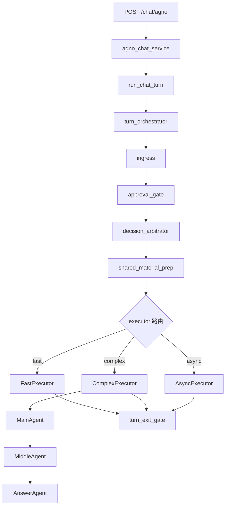

# AGENTS.md — 项目 Agent 架构说明

## 三层 Agent 协作

> 对外口径：本项目**默认不是"多个 Agent 自主对话 / 互相协作"**，而是 **LLM 增强的分层工作流编排 + 端口隔离**。控制流（路由 / 升级 / 出口收口）由规则化主链决定，LLM 主要用于意图识别与最终生成；本节描述的三层协作是 `complex` 链上的事实结构，但**不是所有请求的默认路径**。

三层 Agent 协作只完整存在于 `complex` 主链中，不代表所有请求的默认运行顺序。

更贴近当前代码现实的口径是：

```
POST /chat/agno
→ agno_chat_service（facade / monkeypatch 锚点）
→ run_chat_turn（薄 facade）
→ turn_orchestrator（唯一主链入口）
→ ingress → approval_gate → decision_arbitrator → shared_material_prep
→ FastExecutor / ComplexExecutor / AsyncExecutor
→ （complex 时）MainAgent → MiddleAgent → AnswerAgent
→ turn_exit_gate
```

### 主链流程图（turn 级）



### MainAgent（复杂链协作起点）

- 职责：在 `complex` 主链里负责协作方向、任务规划和复杂任务处理起点
- 位置：`backend/agents/main_agent/`
- 关键文件：`runtime.py`（入口）、`main_invoke_flow.py`（路由状态机）

说明：
- 入口初始 `lane / mode` 不只由 MainAgent 决定
- 当前默认入口初判在 `backend/application/ingress/`

### MiddleAgent（中间执行）

- 职责：执行工具调用、检索知识、收集多来源材料、组装证据包
- 位置：`backend/agents/middle_agent/`
- 关键文件：`runtime.py`（入口）、`gather_phase.py`（收集阶段）、`judgment_phase.py`（判断阶段）

### AnswerAgent（最终生成）

- 职责：基于收集到的材料，生成最终回答
- 位置：`backend/agents/answer_agent/`
- 关键文件：`runtime.py`（入口）

---

## 编排入口

- **API 层**：`backend/api/routes/chat_agno.py` → `POST /chat/agno`
- **Service 层**：`backend/services/agno_chat_service.py`（monkeypatch 锚点）
- **Implementation**：`backend/application/chat/turn_orchestrator.py`（`run_chat_turn.py` 仅为薄 facade）

补充：
- 统一公共出口：`backend/application/chat/turn_exit_gate.py`
- 统一材料层语义：`backend/application/chat/material_flow.py`
- 统一资料生命周期：`backend/services/capabilities/knowledge/pending_ingestion_service.py`

---

## 工具体系

位于 `backend/tools/`：

| 工具 | 目录 | 说明 |
|------|------|------|
| 文档解析 | `tools/document/` | PDF/DOCX/XLSX/TXT |
| 网页搜索 | `tools/search/` | DuckDuckGo / Tavily |
| 网页抓取 | `tools/web/` | 静态 + 动态(Playwright) |
| 视频处理 | `tools/video/` | 字幕提取、ASR |
| ASR | `tools/asr/` | 语音转写 |

---

## 知识库（RAG）

- 位置：`backend/rag/`
- 核心：`retriever.py`（检索）、`ingest.py`（入库）、`hybrid_retrieve.py`（混合检索）

当前知识沉淀口径：
- `prepare` 只解析、不入库
- 用户明确要求保存后才 `commit`
- 入库后再通过 retrieval 命中

---

## 规则

- 不允许 Agent 之间直接互相调用（必须通过编排层）
- 不允许工具层访问 Agent 状态
- 配置集中在 `backend/config/`
- 成本规则：`config/cost_rule.py`
- 安全规则：`config/safe_rule.py`

当前对外表达时要避免的误导：
- 不要把整个系统写成 `用户 -> Main -> Middle -> Answer`
- 不要把 `async` 写成默认路径，它是少数重任务的后台兜底出口
- 不要把“抓到内容”写成“自动入库”，当前是先处理、后保存、再 commit

---

## 统一治理主轴（薄锚点）

> 细则以可执行守卫为准，本节只指向真源，不重复散文。

### 改动分级

| 级别 | 含义 | 纪律 |
|------|------|------|
| **(a)** | 内部重构，不动公共契约 | 零 ceremony；不 mint 版本字段、不建 migration ledger |
| **(b)** | 加性契约（新字段/观测/flag） | 只改单一真源 + feature flag 可回退 |
| **(c)** | 破坏性契约 | shadow → eval-gate → 全套；禁止把 (a)(b) 当 (c) 做 |

### 测试 / smoke 数据隔离（硬红线）

- **真实业务库**：库名 `light_maqa`（无 `_sandbox` / `_test` / `_ci` 后缀）；主链 `docker-compose.yml`。
- **隔离库**：`light_maqa_metrics_sandbox`（`docker-compose.metrics-sandbox.yml`，端口 5433，项目名 `metrics_sandbox`）。
- 测试 / smoke / 指标沙箱脚本**不得硬编码**指向真实业务库；守卫：`scripts/check_test_db_isolation.py`。
- CI 的 ephemeral Postgres 由 workflow 注入 `DATABASE_URL`，不在测试源码里写死。

### 单一真源与守卫（代码即治理）

| 领域 | 真源 | 守卫 |
|------|------|------|
| 评测红线 / 字段分层 / A·B·C 规则 | `docs/evidence/eval_governance_guardrails.md` | `tests/evaluation/` 规则目录 |
| 稳定出口字段 | `backend/application/chat/turn_exit_gate.py` | `scripts/check_stable_exit_fields.py` |
| 字段写权限 | `backend/application/chat/field_owners.py` | `scripts/check_field_owner_writes.py` |
| 主链 frozen | — | `scripts/check_frozen_chat_modules.py` |
| import 边界 | — | `scripts/check_import_boundaries.py` |
| compat 退役 | `docs/current/migration/shims.csv` | `scripts/check_shim_age.py`、`check_compat_retirement.py` |
| 产品指标 | `backend/application/analytics/product_metrics.py` | `scripts/report_product_metrics.py`（只读渲染） |
| 证据新鲜度 | `docs/evidence/project_validation_summary.md` 等 | `scripts/check_evidence_freshness.py`（C 级 warning） |

### 指标 / 周报落点

- 样本：`scripts/metrics_sandbox_samples.yaml` → 跑：`scripts/run_metrics_sandbox.ps1`
- 产物：`_local/reports/metrics/weekly_<date>.{json,html}`（gitignored）
- 对外叙事：`docs/pm/04_产品指标看板.md`（三态结论，不整份 JSON 进库）
