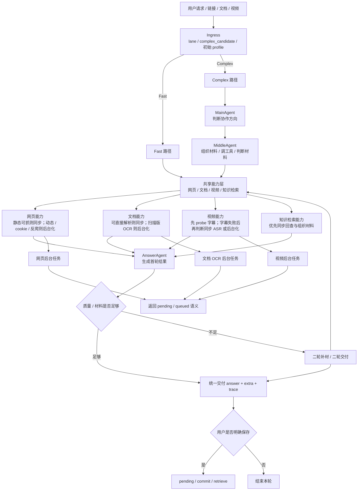
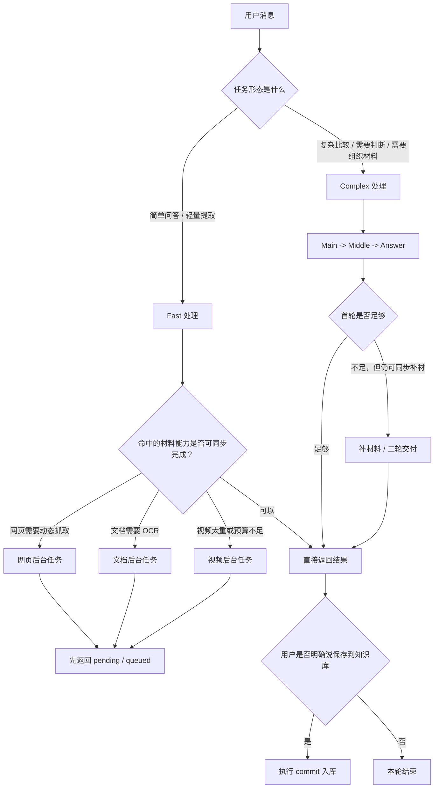

# LightMultiAgentQA

一个面向学习复盘、知识沉淀和多来源信息处理的 AI 应用原型。

> 对外口径（重要）：本项目**默认不是"多个 Agent 自主对话 / 互相协作"**，而是 **LLM 增强的分层工作流编排 + 端口隔离**。流程（路由 / 升级 / 出口）由规则化主链决定，LLM 主要用于**意图识别**与**最终生成**；只有 `complex` 复杂任务才会进入 Main → Middle → Answer 三层协作。下文出现的"三层 Agent"均指 complex 链上的分层协作，不代表所有请求的默认路径。

它不是单纯的“问答机器人”或“知识库 demo”，而是尝试解决一个更具体的问题：

`高价值信息虽然很多，但散落在视频、网页、文档和个人笔记里，时间一长很容易流失，之后也很难再次调用。`

这个项目当前重点验证两件事：
- 能不能把一次性消费的信息，变成后续可搜索、可回查、可继续追问的知识资产
- 当用户现在就要做判断时，系统能不能直接对多个外部来源做当轮比较，而不是强迫用户先做知识管理

从实现上看，它已经不是一个简单的 Demo，而是一个带有：
- 分层协作编排（复杂任务才进入三层 Agent）
- Fast / Complex / Async 分流
- 网页 / 视频 / 文档 / 知识库多来源能力
- pending / commit / retrieve 知识沉淀链
- 质量门、状态语义、测试矩阵

的完整原型系统。

## 这个项目到底能做什么

当前最有代表性的能力有四类：

### 1. 即时回答与轻量处理

适合：
- 普通问答
- 简单解释
- 单来源快速提取

系统会优先尝试 Fast 路径，以更低成本、更短路径完成交付，而不是默认进入复杂链路。

### 2. 多来源即时比较

适合：
- 两个或多个网页链接比较
- 两个来源观点差异提炼
- 多来源材料的当轮总结、归纳和基础判断

这条路径不强制要求先入库，系统可以在当轮抓取、提炼、组织比较结果。

### 3. 资料沉淀与后续复用

适合：
- 视频转文字后保存
- 网页正文处理后保存
- 文档解析后保存
- 笔记类文本进入知识库

这里的设计不是“抓到内容就自动入库”，而是：

`先处理，后确认保存。`

也就是说，系统先把内容处理成当前可用结果；用户确认这份内容值得留下后，再执行 commit 入库。这样更符合知识管理场景，也能避免低价值内容污染知识库。

### 4. 复杂任务升级处理

适合：
- 不是简单总结，而是需要比较、取舍、判断、组织材料的任务
- Fast 路径结果不够好，需要升级
- 材料不足，需要补充证据再交付

这部分会进入复杂链路，通过 Main / Middle / Answer 的协作来完成。

## 项目亮点

- `即时处理 + 长期沉淀` 双路径
  - 先处理当前问题，再由用户决定是否保存到知识库，而不是默认自动入库
- `Fast / Complex / Async` 多路径分流
  - 简单问题优先快路径；复杂问题进入多阶段协作；少数重任务才异步返回
- `分层协作编排`（复杂链才走三层 Agent，非默认路径）
  - MainAgent 负责协作方向
  - MiddleAgent 负责材料组织、工具调用与材料判断
  - AnswerAgent 负责最终交付
- `多来源能力`
  - 支持视频、网页、文档、笔记等内容处理
  - 支持多个外部来源的当轮即时比较
- `知识沉淀链路`
  - pending / commit / retrieve 分离
  - 保留人在回路，避免低价值内容直接进入知识库
- `可验证的产品方法`
  - 已补场景复盘、指标看板、竞品分析、深度方案和路由测试矩阵

## 为什么这个项目不只是“套了 Agent 概念”

这个仓库里真正做的不是“把几个 Agent 名字写上去”，而是把协作边界、材料处理和交付逻辑拆开了：

- MainAgent 不是负责把所有事做完，而是负责判断这轮问题该怎么处理
- MiddleAgent 不是只调工具，而是负责材料组织、检索、补材和材料侧判断
- AnswerAgent 不是自由发挥，而是基于已有材料和主链约束生成最终结果
- Fast 路径和复杂链路不是同一套逻辑的快慢版本，而是不同任务下的不同工作方式
- Async 不是“以后再说”，而是少数重任务的正式后台退出语义

这意味着你可以把它理解成一个真正有主链治理的系统，而不是几个函数互调的包装层。

## 当前更成立的能力

- 视频转文字沉淀并复盘
- 网页、文档、笔记在确认保存后进入知识库，支持后续检索与回查
- 多个网页 / 视频 / 文档来源在当轮直接提取并进行基础比较

## 当前边界

- 这个项目已经是可跑原型，但还不是成熟商业产品
- 更深层的长期个人复盘和复杂分析仍在持续验证
- 当前不把“抓到内容”自动等同于“应该直接入库”
- 当前“单轮网页抓取并直接保存入库”不是默认主路径，知识沉淀仍然以用户确认保存为准
- 验证分层（重要）：默认 CI（`.github/workflows/ci.yml`，FAKE LLM）跑的是轻量单测/集成 + 架构守卫，**不等于** 42/42 工程回归与 7/7 真实外部能力；后两者需 staging / 手动跑（`py -3.12 scripts/evaluation/run_project_validation.py --profile full-staging --execute`）。单一口径见 `docs/evidence/project_validation_summary.md`

## 典型使用方式

### 用法 1：直接问一个问题

```text
用户：RAG 和传统关键词搜索有什么区别？
系统：优先走 Fast，直接回答
```

### 用法 2：给多个链接做即时比较

```text
用户：比较这两个网页的观点差异
系统：当轮抓取多个来源 -> 组织差异与共识 -> 返回比较结果
```

### 用法 3：先处理，再决定是否保存

```text
用户：帮我提取这个网页正文
系统：先处理并返回结果
用户：把这个保存到知识库
系统：执行 commit，后续可检索回查
```

### 用法 4：围绕已保存资料继续追问

```text
用户：基于我刚保存的资料，再帮我总结它和另一份资料的差异
系统：从知识库取回已沉淀内容，再结合当前问题继续处理
```

## 系统一句话

用户请求
→ `POST /chat/agno`
→ 入口判断 lane / mode
→ 简单任务优先 Fast；复杂任务才进入 Main→Middle→Answer 协作链；只有少数外部重处理任务才转后台
→ 共享能力层负责网页、文档、视频、知识检索等材料处理
→ 用户确认后才进入 knowledge 的 pending / commit / retrieve 链路
→ 返回 `answer + extra + trace`

路由与升级口径详见 [docs/current/04_默认路由_材料流与质量门控规则.md](docs/current/04_默认路由_材料流与质量门控规则.md)。

## 核心架构

### 外层：平台式分流与共享能力

- Ingress：判断 lane、complex_candidate、初始执行档位
- Shared Capability Layer：网页、文档、视频、知识检索等共享能力
- Quality Gate：决定当前结果是否可直接交付，或是否需要升级 / 补材 / 二轮
- Approval Gate：处理用户确认后的保存 / commit 闭环
- Async Control：处理需要后台执行的任务

### 内层：三层 Agent 协作

```text
用户消息
  -> MainAgent
  -> MiddleAgent
  -> AnswerAgent
  -> 最终回答
```

说明：
- 这里只描述 `complex` 协作链
- 不代表所有请求默认都先经过三 Agent

角色分工：
- MainAgent：判断用户意图和协作方向
- MiddleAgent：执行工具调用、收集多来源材料、组织证据
- AnswerAgent：基于已有材料生成最终交付

### Mermaid 架构图



### 请求路径图



### 当前真实主链

更贴近代码现实的顺序是：

```text
用户请求
  -> Ingress 判断 lane / mode
  -> approval / arbitrator / shared prep
  -> Fast 或 Complex 或 Async
  -> 如进入 Complex，再走 Main -> Middle -> Answer
  -> 如材料或质量不足，可能进入二轮补材 / 二轮交付
  -> 返回 answer + extra + trace
```

这也是为什么 README 里不能简单写成“用户 -> Main -> Middle -> Answer”。

## 知识沉淀为什么要分成 pending / commit / retrieve

这是这个项目很重要的一点。

当前实现里，知识沉淀不是“抓到内容就直接入库”，而是拆成三步：

1. `pending`
   - 资料先被处理成待保存材料
   - 当前轮可以先被消费
2. `commit`
   - 用户明确说保存 / 入库后，才正式写入知识库
3. `retrieve`
   - 入库后，后续轮次再通过检索拿回这些内容

注意：
- “单轮网页抓取并直接保存入库”当前不是默认主路径
- 更贴近代码现实的是：先处理 / 先回答，用户明确保存后再 commit

这样做的好处是：
- 降低低质量内容污染知识库的风险
- 更符合真实知识管理心智
- 把“即时处理”和“长期复用”明确拆开

## 当前支持 / 当前不支持

### 当前支持

- 普通问题优先走 Fast 路径
- 网页正文抓取与当轮回答
- 文档上传与解析
- 视频内容提取、字幕整理与后续保存
- 多个网页 / 视频 / 文档来源的当轮即时比较
- 复杂任务的升级处理与二轮补材
- 用户明确确认后的知识入库
- 入库后的检索、回查、追问
- `pending / partial / blocked / succeeded` 等状态语义输出

### 当前不支持或不默认支持

- 抓到任意内容后自动直接入库
- 单轮“网页抓取 + 立即保存入库”作为默认主路径
- 把长期个人复盘和成长洞察当作已成熟能力
- 把复杂链路当成所有任务的默认入口
- 把 Async 当成普通问答的常规处理方式

## 示例请求与返回

### 示例 1：普通问答

请求：

```json
{
  "message": "RAG 和传统关键词搜索有什么区别？",
  "session_id": "demo-001",
  "use_knowledge": false
}
```

典型返回结构：

```json
{
  "ok": true,
  "session_id": "demo-001",
  "answer": "……",
  "answer_type": "fast_path",
  "task_status": "succeeded",
  "primary_path": "web_fast",
  "extra": {
    "lane": "general",
    "mode": "fast",
    "executor_profile": "fast"
  }
}
```

### 示例 2：先处理，再保存

第一轮请求：

```json
{
  "message": "请抓取这个网页的文字正文：https://example.com/article",
  "session_id": "demo-002",
  "use_knowledge": false
}
```

第二轮请求：

```json
{
  "message": "把这个保存到知识库",
  "session_id": "demo-002",
  "use_knowledge": false
}
```

典型返回结构：

```json
{
  "ok": true,
  "session_id": "demo-002",
  "answer": "已成功保存到知识库：……",
  "answer_type": "commit_executed",
  "task_status": "succeeded",
  "extra": {
    "lane": "approval_gate",
    "approval_gate.executed": true,
    "commit_success": true,
    "commit_source_id": "web_url/..."
  }
}
```

### 示例 3：异步处理

请求：

```json
{
  "message": "请处理这个很长的视频并提取主要内容",
  "session_id": "demo-003",
  "use_knowledge": false,
  "confirm_long_web_video_asr": true
}
```

典型返回结构：

```json
{
  "ok": true,
  "session_id": "demo-003",
  "task_id": "task-xxx",
  "answer": "……",
  "answer_type": "async_pending",
  "task_status": "pending",
  "extra": {
    "mode": "async",
    "pending_kind": "processing_pending"
  }
}
```

### 公开请求字段

- `message`：用户输入
- `session_id`：会话 ID，跨轮保存与追问必须一致
- `use_knowledge`：是否启用知识库相关处理
- `confirm_long_web_video_asr`：是否确认长视频 ASR

### 公开响应字段

- `answer`：本轮用户可见结果
- `answer_type`：结果类型，如 `fast_path` / `commit_executed` / `approval_blocked` / `async_pending`
- `task_status`：公开状态，如 `succeeded` / `pending` / `blocked` / `partial`
- `primary_path`：主路径标签
- `extra`：详细 trace、路由、状态语义、门控与材料信息

## 代码结构怎么读

如果你第一次进这个仓库，建议先看下面几个地方：

### 1. API 与主入口

- `backend/api/routes/chat_agno.py`
- `backend/api/main.py`
- `backend/application/chat/run_chat_turn.py`

这是默认主路由和真实聊天主链。

### 2. 三个 Agent

- `backend/agents/main_agent/`
- `backend/agents/middle_agent/`
- `backend/agents/answer_agent/`

如果你想理解这个项目“多 Agent”到底是不是认真的，这里是最值得看的部分。

### 3. 分流与门控

- `backend/application/ingress/`
- `backend/application/chat/shared_material_prep.py`
- `backend/application/chat/delivery_gate_flow.py`
- `backend/application/chat/approval_gate_flow.py`
- `backend/application/chat/executors/async_executor.py`
- `backend/application/chat/executors/async_path/build_pending.py`

这些文件决定：
- 什么时候走 Fast
- 什么时候升级 Complex
- 什么时候返回 Async
- 什么时候允许 commit

### 4. 知识与材料链路

- `backend/services/capabilities/knowledge/pending_ingestion_service.py`
- `backend/services/capabilities/knowledge/retrieve_service.py`
- `backend/storage/knowledge_store.py`
- `backend/rag/`

这里能看清楚 pending / commit / retrieve 这条链。

### 5. 真实资料能力

- `backend/tools/web/`
- `backend/tools/document/`
- `backend/tools/video/`
- `backend/tools/asr/`

这些是系统真正拿内容的地方。

## 推荐阅读顺序

如果你是第一次接触这个项目，推荐这样看：

1. 先看本文前半部分，理解项目到底想解决什么问题
2. 再看 `docs/current/04_默认路由_材料流与质量门控规则.md`
3. 再看 `docs/current/03_目标运行路径与架构验收表.md`
4. 最后进 `backend/application/chat/` 和 `backend/agents/`

如果你想看当前项目说明、产品方案和求职材料，可以去：
- `docs/pm/`

如果你想回看旧版本和历史材料，可以去：
- `docs/history/pm/`

当前保留的必要文档入口见：
- [docs/README.md](/D:/1/A1_publish/docs/README.md)

## 仓库目录口径

- `backend/`：后端源码与主链
- `frontend/`：前端源码
- `tests/`：分层测试
- `scripts/`：项目级操作脚本
- `data/`：可提交样本
- `_local/`：本地运行产物

当前只保留两条有效版本线：

- `V16`：Tool 集成与真实资料处理
- `V17`：三 Agent 架构与多来源协商

## 检索主路口径

当前知识检索对业务侧统一只有一条默认主路：

- 默认检索策略：`auto`
- `keyword / semantic / hybrid`：仅保留给内部调试、验收和定向实验

`auto` 的真实落点由运行时条件决定：

- `EMBEDDING_ENABLED=1` 且 `rag_embeddings` 有数据：优先走 `hybrid`
- `EMBEDDING_ENABLED=0`：自动降级为 `keyword`（且不 commit 写向量）
- `hybrid` 失败：降级 `semantic`
- `semantic` 失败：再降级 `keyword`

因此，**对业务方不再承诺“当前系统默认就是 keyword 或 hybrid”**；真正执行路径以 trace 中的
`strategy_requested / strategy_used / auto_reason` 为准。

当前仓库默认运行值：

- `RETRIEVAL_MODE=auto`
- `EMBEDDING_ENABLED=1`
- `CHAT_SYNC_BUDGET_MS=30000`

也就是说，默认主路已升级到“优先 hybrid、失败再回退 keyword”，复杂题同步预算默认 30 秒。

## 目录边界

- `backend/agents/`：Main / Middle / Answer 三 Agent（**只消费**门控结果，不做路由/充分度/二轮决策）
- `backend/api/`：FastAPI 对外接口
- `backend/application/chat/`：单轮聊天主链编排（**见该目录 README**）
- `backend/application/ingress/`：lane / complex_candidate / 初始 profile
- `backend/services/capabilities/knowledge/`：KB 检索编排、充分度、pending
- `backend/tools/`：拿内容的能力层
- `backend/knowledge/`：知识材料管理（pending / commit / search / index）
- `backend/storage/`：数据库 / 文件 / 向量存储访问
- `backend/config/`：成本/安全/上传/URL 等规则
- `backend/core/`：错误模型、请求上下文、可观测性

## 聊天主链门控（高层）

| 层 | 落点 | 判什么 |
|----|------|--------|
| Ingress | `application/ingress/` | lane、complex_candidate、初始 executor profile |
| Shared retrieval | `application/chat/shared_material_prep.py` | KB snapshot（fast/complex 共用） |
| Quality gate | `application/chat/delivery_gate_flow.py` | 交付 / 升级 / 二轮 |
| Feedback gate | `services/execution/feedback_gate.py` | 二轮动作许可 |
| Approval gate | `application/chat/approval_gate_flow.py` | 用户确认 + **commit 执行闭环** |
| Material trace | `application/chat/material_flow.py` | 全路径 temporary / pending / committed |

**已拍板**：`multi_source_compare` 无豁免，与普通 complex 共用 `quality_gate` 二轮模型；material trace 与 trace baseline 必须全路径一致。

## 入口汇总（唯一入口）

| 用途 | 入口 |
|------|------|
| 后端启动 | 推荐 `python scripts/run_dev.py --backend`；等价手动：先设置 `PYTHONPATH` 指向 `backend/`（见下文），再 `python -m uvicorn api.main:app`。不要使用 `backend.api.main:app`，易与包路径不一致。 |
| 前端启动 | `cd frontend && npm run dev` |
| 聊天主链 | `backend/application/chat/run_chat_turn.py` |
| API 路由 | `backend/api/main.py` |
| OpenAPI 快照 | `docs/current/openapi.json`；刷新：`PYTHONPATH=backend python scripts/export_openapi.py docs/current/openapi.json` |
| CI | `.github/workflows/ci.yml`（pytest 覆盖率：主链 `application+agents` **≥75%**、全 `backend` **≥60%**；nightly KB benchmark 见 `nightly_benchmark.yml`） |
| 真实验收 | `.github/workflows/real_external.yml`（手动触发） |

## 启动方式

> 支持的 Python 版本：**3.12**（与 CI、`Dockerfile`、`requirements.lock` 基线一致）。`pyproject.toml` 的 `requires-python` 下限为 3.11；3.13 / 3.14 等更高版本**未验证**，可能在依赖或运行时出现兼容问题。

### 后端

```powershell
py -3.12 -m pip install -r requirements.lock
# 须配置 .env 中 DATABASE_URL=postgresql://…（见 .env.example）。本地可先启动 PostgreSQL
# 或仅起数据库：docker compose up -d postgres
py -3.12 scripts/run_dev.py --backend
```

若需**直接**启动 uvicorn（与 `run_dev.py` 一致：`PYTHONPATH` **仅**含 `backend/`，cwd 为仓库根）：

```powershell
$env:PYTHONPATH = "backend"
py -3.12 -m uvicorn api.main:app --host 127.0.0.1 --port 8000
```

多 worker（`>1` 时关闭 `--reload`）：`py -3.12 scripts/run_dev.py --backend --workers 4`。`Dockerfile` 中生产进程默认 **`uvicorn --workers 2`**。

对外提供或共享后端时，在 `.env` 中设置 **`API_BEARER_TOKEN`**（见 `.env.example`）。非空时除 `/health`、`/docs`、`/openapi.json`、`/redoc` 外，所有 API 须带请求头 **`Authorization: Bearer <与环境中相同的 token>`**；未设置该变量则与旧行为一致（本地开发可留空）。前端在 **`frontend/.env.local`** 设置 **`NEXT_PUBLIC_API_BEARER_TOKEN`**（与后端相同值）时，`frontend/lib/client.ts` 会自动为 API 请求附带该头；未设置则不发送 `Authorization`。

**运行数据与数据库**：服务端会话、任务、RAG、向量元数据等均落在 **PostgreSQL**。必须在 `.env` 配置 **`DATABASE_URL=postgresql://…`**（见 `.env.example`）；未配置则进程启动会失败。**生产/一体化运行**推荐 **`docker compose up`**（`docker-compose.yml` 已包含 `postgres` 与 `DATABASE_URL`）。本地可单独启动数据库：`docker compose up -d postgres`，再运行 `scripts/run_dev.py --backend`。pytest 默认期望本机或 CI 中已提供可用的 `DATABASE_URL`（与 compose 账号一致）。

（依赖以 `requirements.lock` 为准，由 `pyproject.toml` 经 `pip-compile` 生成。更新锁文件时请使用 **Python 3.12**（与本仓库 `Dockerfile` / 工具链一致）。当前锁文件默认覆盖 `dev + ocr + asr-local + test-pdf`，例如：`py -3.12 -m piptools compile pyproject.toml --extra dev --extra ocr --extra asr-local --extra test-pdf -o requirements.lock --strip-extras`。）

### 运行时外部依赖

`requirements.lock` 已覆盖 Python 包依赖，但以下运行时组件仍需按场景准备：

- Playwright 浏览器：`py -3.12 -m playwright install chromium`
- OCR 本地 fallback：默认文档 OCR 主路应走腾讯云等外部 provider；只有启用 `local_tesseract`，或腾讯 OCR 失败后希望自动回退本地 OCR 时，才需要系统安装 [Tesseract OCR](https://github.com/tesseract-ocr/tesseract)
- 音视频处理：视频链在“无字幕 -> 抽音频 / 分段 -> 在线 ASR”这条路径上会真实依赖 `ffmpeg`

如果你只跑默认聊天主链、KB、网页和普通文档流程，Playwright 是最常见的额外依赖；`Tesseract` 不是默认必需项，`ffmpeg` 则主要在视频能力开启时需要。

### 前端

```powershell
cd frontend
npm install
npm run dev
```

与后端 **Bearer** 对齐：若后端启用了 `API_BEARER_TOKEN`，请在 `frontend/.env.local`（勿提交）写入 **`NEXT_PUBLIC_API_BEARER_TOKEN`**（值与后端一致）；未设置则浏览器请求不携带 `Authorization`。

## 测试

全部回归：

```powershell
python -m pytest -q
```

仅 smoke：

```powershell
python -m pytest -q -m smoke
```

CI 默认门禁：

```powershell
python -m pytest -q -m "not real_external"
```

按目录分层跑：

```powershell
python -m pytest -q tests/smoke tests/backend tests/integration tests/acceptance
```

## 目录总览

```text
项目代码/
├─ backend/
│  ├─ agents/
│  ├─ api/
│  ├─ application/chat/
│  ├─ config/
│  ├─ core/
│  ├─ knowledge/
│  ├─ llm/
│  ├─ rag/
│  ├─ services/
│  ├─ storage/
│  ├─ tools/
│  └─ video/
├─ frontend/
├─ tests/
│  ├─ unit/
│  ├─ backend/
│  ├─ integration/
│  ├─ smoke/
│  ├─ acceptance/
│  ├─ _support/
│  ├─ _fixtures/
│  └─ fixtures/
├─ data/
├─ docs/
│  ├─ current/
│  ├─ history/
│  └─ evidence/
├─ scripts/
├─ _local/
├─ pyproject.toml
├─ requirements.lock
└─ .env.example
```

## 文档入口

- [docs/README.md](/D:/1/A1_publish/docs/README.md)
- `docs/current/01_运行说明.md`
- `docs/current/03_目标运行路径与架构验收表.md`
- `docs/current/02_环境变量与数据库.md`
- `docs/current/04_默认路由_材料流与质量门控规则.md`
- `AGENTS.md` — Agent 架构与规则说明

## Benchmark 约定

- `scripts/benchmarks/run_agent_eval.py` 与 `scripts/benchmarks/run_kb_agent_eval.py`
  默认都使用 `--runner local`
- `local` 表示直接调用当前工作区代码，不依赖外部 `127.0.0.1:8001` 服务进程
- 只有在明确要验证独立运行中的 HTTP 服务时，才使用 `--runner http`

这样可以避免 benchmark 误打到旧进程、旧配置或热重载不一致的运行态。

## 当前收口状态

- 目录迁移（R-001~R-018）：全部完成
- `backend/` 是唯一 Python 包根（`pythonpath = ["backend"]`）
- 旧顶层源码目录已全部删除
- 成本/安全/上传/URL 四层规则已建立
