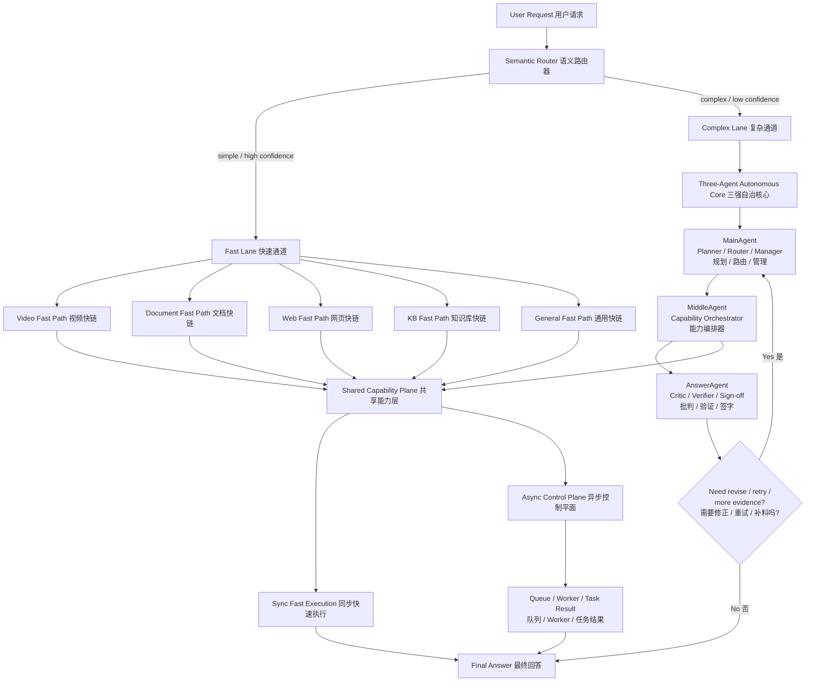

# 平台图 + 三强自治核心架构迁移执行计划

## 1. 背景与目标

当前项目已经具备：

- `MainAgent -> MiddleAgent -> AnswerAgent` 三强 Agent 主链
- 视频链统一能力层的初步雏形
- 任务状态机、后台任务、部分 queue / worker 能力

但当前仍存在这些结构性问题：

1. 所有请求仍然过度依赖统一重主链，简单请求与复杂请求没有被足够早地分流。
2. 视频、文档、网页、知识库等能力还没有完全演化为稳定的 `lane + capability plane` 结构。
3. 三强 Agent 虽然存在，但整体更接近“单轮协作签字系统”，还不是稳定的“三强自治核心”。
4. `tasks / workers` 已经出现，但还没有真正升级成平台级 `Async Control Plane`。
5. 目录职责正在成形，但还没有完全服务于最终目标架构。

本计划的目标是将项目迁移为：

- **外层采用平台图**
- **内层保留三强自治核心**

最终架构原则：

1. **外层快分流**：简单请求优先走 `Fast Lane`，复杂请求走 `Complex Lane`。
2. **内层强自治**：复杂请求进入 `Main / Middle / Answer` 的三强自治闭环。
3. **能力共享**：视频 / 文档 / 网页 / 知识库能力统一沉到 `Shared Capability Plane`。
4. **异步平台化**：长任务、多视频、大文档、复杂研究任务统一进入 `Async Control Plane`。
5. **目录治理优先**：先稳定结构，再迁移运行时，再切换默认运行路径。

---

## 2. 目标架构图



---

## 3. 设计原则

### 3.1 外层平台图

外层负责：

- 入口分类
- `Fast Lane / Complex Lane` 分流
- 简单请求短路径执行
- 复杂请求升级到自治模式
- 同步 / 异步模式切换

外层不负责：

- 具体视频切段
- 具体 OCR
- 具体网页抓取
- 具体知识检索细节

### 3.2 内层三强自治核心

内层负责：

- `MainAgent`：任务规划、lane 决策、复杂模式策略选择
- `MiddleAgent`：能力编排、重试、fallback、同步/异步决策
- `AnswerAgent`：证据审查、是否补料、最终签字

内层不负责：

- provider 细节
- 音频切段细节
- queue backend 实现
- worker 线程/进程实现

### 3.3 Shared Capability Plane

沉淀：

- 视频能力
- 文档能力
- 网页能力
- 知识检索能力
- 汇总能力
- retry / fallback / execution helper

### 3.4 Async Control Plane

统一承载：

- 长视频
- 多视频
- 大文档
- 多网页
- 长耗时复杂研究任务

---

## 4. 迁移总览

本次迁移分两大部分：

### Part A. 结构迁移

- Phase 1 ~ Phase 5
- 目标：解决“代码怎么摆放、谁归谁管、哪些文件不该继续长胖”

### Part B. 运行时重构

- Phase 6 ~ Phase 10
- 目标：解决“系统是否真的按目标架构运行”

---

## 5. Phase 1~10 结构目录

### Phase 1：目标架构冻结

#### 目标

冻结目标图、命名、角色边界、平台层定义，后续所有迁移都以本文件为准。

#### 输出物

- 本执行计划文档
- 最终目标架构图
- 术语表：`Semantic Router / Fast Lane / Complex Lane / Shared Capability Plane / Async Control Plane / Three-Agent Autonomous Core`

#### 完成标准

1. 项目正式采用“外层平台图，内层三强自治核心”的目标架构。
2. 后续迁移、重构、目录调整都不得偏离本图。

#### 验收标准

1. 文档中已清楚定义所有关键层与职责。
2. 项目组内讨论时不再以“统一大主链”作为默认终局结构。

---

### Phase 2：目录职责文档化

#### 目标

给关键根目录和关键子目录补 README，固定职责边界。

#### 范围

- `backend/application/README.md`
- `backend/agents/README.md`
- `backend/services/README.md`
- `backend/tasks/README.md`
- `backend/workers/README.md`
- `backend/tools/README.md`
- 后续关键子目录 README

#### README 最小内容模板

1. `Responsibilities`
2. `Boundary / What not to put here`
3. `Owned files`
4. `Files that must not keep growing`

#### 完成标准

1. 关键目录都有职责 README。
2. 每个 README 都明确“不该放什么”和“不该继续长胖的文件”。

#### 验收标准

1. 新增功能时，开发者能快速判断归属目录。
2. 对于跨层逻辑，能依据 README 判断是否放错层。

---

### Phase 3：文件级迁移清单制定

#### 目标

形成完整的文件迁移清单，而不是边改边决定。

#### 清单必须覆盖

1. 哪些现有文件未来应该搬到哪个子目录
2. 哪些文件只需要保留但收敛职责
3. 哪些文件应该拆分
4. 哪些文件以后不该继续长胖

#### 完成标准

1. 所有高风险核心文件都有明确迁移策略。
2. 不再存在“以后再看放哪”的关键文件。

#### 验收标准

1. 至少覆盖：
   - `run_chat_turn.py`
   - `main_agent/*`
   - `middle_agent/*`
   - `answer_agent/*`
   - `services/video_*`
   - `tools/video/*`
   - `tasks/*`
   - `workers/*`
2. 每个高风险文件都被标记为：
   - move
   - retain+shrink
   - split

---

### Phase 4：目录迁移与子目录化

#### 目标

把当前目录结构迁移成更接近目标架构的形态。

#### 重点

1. `services/` 子目录化：
   - `services/capabilities/video/`
   - `services/capabilities/document/`
   - `services/capabilities/web/`
   - `services/capabilities/knowledge/`
   - `services/execution/`
2. `tasks/` 子目录化：
   - `queue/`
   - `orchestration/`
3. `workers/` 子目录化：
   - `entry/`
   - `pools/`
   - `runtimes/`

#### 完成标准

1. 高增长 service 文件不再全部平铺在 `services/` 根目录。
2. `tasks/` 和 `workers/` 形成正式平台层结构。

#### 验收标准

1. 目录结构已经能映射目标架构图。
2. 视频能力层不再只是“零散 service 文件集合”。

---

### Phase 5：文件拆分与职责收敛

#### 目标

控制高风险上帝文件继续膨胀，并把职责拆干净。

#### 重点文件

1. `backend/application/chat/run_chat_turn.py`
2. `backend/agents/middle_agent/video_flow.py`
3. `backend/tools/video/extract_web_video_subtitle.py`
4. `backend/tools/video/extract_local_video_subtitle.py`
5. `backend/services/video_background_pipeline.py`
6. `backend/services/` 根目录平铺结构

#### 完成标准

1. 高风险文件职责收敛。
2. 新能力不再继续堆进这些旧文件。

#### 验收标准

1. `run_chat_turn.py` 只保留顶层请求编排、模式切换、响应组装。
2. `video_flow.py` 只保留 Middle 的视频编排入口，不再承载重处理核心。
3. `tools/video/*` 只保留输入适配与统一服务调用。

---

### Phase 6：Ingress Router 落地

#### 目标

把目标架构中的 `Semantic Router` 和 `Lane Selector` 真正落到运行时。

#### 要做的事

1. 建立 `application/ingress/`
2. 引入轻量分类器与规则优先路由
3. 低置信度升级到 LLM Router 或 MainAgent 决策
4. 明确这些 lane：
   - `video`
   - `document`
   - `web`
   - `kb`
   - `general`
5. 明确这些 mode：
   - `fast`
   - `complex`

#### 完成标准

1. 请求不再默认全部进入统一重主链。
2. 明确视频 / 文档 / 网页 / KB / general 的入口分流。

#### 验收标准

1. 对明确视频 URL 总结请求，不再先跑普通 KB/Web 重路径。
2. 对明确文档解析请求，不再默认走通用对话逻辑。
3. trace 中能看见 lane 和 mode 选择。

---

### Phase 7：Fast Lane 落地

#### 目标

真正建立同步短路径，而不是名义上的快链。

#### 要做的事

1. 建立：
   - `Video Fast Path`
   - `Document Fast Path`
   - `Web Fast Path`
   - `KB Fast Path`
   - `General Fast Path`
2. 定义每条快链的最短首答路径
3. 定义每条快链的升级条件：何时升级到 `Complex Lane`

#### 完成标准

1. 简单请求可不进入三强自治核心完整闭环。
2. 每类请求都有真正可运行的同步短路径。

#### 验收标准

1. 视频、文档、网页、KB 各有可观察的快链 trace。
2. 快链不再默认带入无关能力链。

---

### Phase 8：三强自治核心落地

#### 目标

让 `Main / Middle / Answer` 从“单轮签字协作”升级为“三强自治闭环”。

#### MainAgent 要升级什么

- route strategy
- lane strategy
- mode selection
- complex escalation policy
- revise trigger handling

#### MiddleAgent 要升级什么

- capability orchestration
- retry / fallback
- sync / async switch
- per-lane execution control
- material sufficiency management

#### AnswerAgent 要升级什么

- critic
- verifier
- more evidence request
- revise feedback
- final sign-off

#### 完成标准

1. `Need revise / retry / more evidence` 不再只是局部 patch，而是稳定闭环机制。
2. 三强 Agent 都具备自治职责，而不是只会单次 `run()`.

#### 验收标准

1. 复杂请求能出现稳定的 revise / retry / replan 闭环。
2. 简单请求不会被强制拖进复杂闭环。

---

### Phase 9：Async Control Plane 泛化

#### 目标

把当前已经出现的 queue / worker 能力，从视频专项升级为全平台异步控制平面。

#### 范围

- 视频长任务
- 多视频
- 大文档
- 多网页
- 长耗时复杂研究任务

#### 要做的事

1. 统一 queue 抽象
2. 统一 worker runtime
3. 统一 task orchestration
4. 统一 timeout / retry / resume / result commit

#### 完成标准

1. `tasks / workers` 不再只是视频链专用设施。
2. 多种重任务共享异步控制平面。

#### 验收标准

1. 视频和至少一种非视频重任务都能进入统一 task plane。
2. `/tasks/{id}` 与 `/tasks/{id}/result` 不依赖某个单一能力特判。

---

### Phase 10：架构验收与旧路径切换

#### 目标

证明系统已经不只是“目录长得像”，而是真的按目标架构运行。

#### 要做的事

1. 为每类请求确认：
   - 走哪条 lane
   - 是 fast 还是 complex
   - 是否进入三强自治闭环
   - 是否进入 async control plane
2. 为旧重路径建立下线/收口计划
3. 建立架构级 trace / metrics 验收表

#### 完成标准

1. 新架构成为默认运行路径。
2. 旧统一重主链不再是所有请求的默认路径。

#### 验收标准

1. 视频 URL 总结请求默认走视频 fast lane 或视频 complex lane，而不是普通 KB/Web 重路径。
2. 文档解析请求默认走文档 lane。
3. 简单 KB 请求默认走 KB fast lane。
4. 复杂多来源请求可进入三强自治闭环。
5. 长任务可进入统一 async control plane。

---

## 6. 目录迁移重点

### 6.1 关键目录最终角色

- `api/`：HTTP 接口层
- `application/`：平台入口与模式控制
- `agents/`：三强自治核心
- `services/`：共享能力平面
- `tasks/`：异步控制平面
- `workers/`：执行平面
- `tools/`：适配器 / provider wrapper
- `video/`：视频来源侧支持

### 6.2 不应继续长胖的核心文件

1. `backend/application/chat/run_chat_turn.py`
2. `backend/agents/middle_agent/video_flow.py`
3. `backend/tools/video/extract_web_video_subtitle.py`
4. `backend/tools/video/extract_local_video_subtitle.py`
5. `backend/services/video_background_pipeline.py`
6. `backend/services/` 根目录平铺结构

---

## 7. 文件级迁移清单（框架级）

### 7.1 未来应迁移到子目录

- `services/video_*` → `services/capabilities/video/`
- 未来 `document_*` → `services/capabilities/document/`
- 未来 `web_*` → `services/capabilities/web/`
- 未来 `knowledge_* / retrieval helper` → `services/capabilities/knowledge/`
- `tasks/video_task_queue.py` → `tasks/queue/video_task_queue.py`
- 后续 queue 工具 → `tasks/queue/`
- worker pool / entry / runtime → `workers/pools/`、`workers/entry/`、`workers/runtimes/`

### 7.2 保留位置但收敛职责

- `application/chat/run_chat_turn.py`
- `agents/main_agent/*`
- `agents/middle_agent/*`
- `agents/answer_agent/*`
- `tools/video/*`

### 7.3 未来应拆分的文件

- `run_chat_turn.py`
- `video_background_pipeline.py`
- `middle_agent/video_flow.py`
- 未来任何继续平铺在 `services/` 根目录且承担大量能力逻辑的文件

---

## 8. 阶段性验收总表

### 8.1 结构迁移验收

1. 关键目录 README 完整
2. 文件级迁移清单完整
3. 高风险文件已标注 move / retain+shrink / split
4. `services / tasks / workers` 开始体现平台分层

### 8.2 运行时重构验收

1. 存在真实 `Semantic Router`
2. 存在真实 `Fast Lane / Complex Lane`
3. 三强 Agent 形成真实自治闭环
4. `Async Control Plane` 可承接视频与非视频重任务

### 8.3 性能与行为验收

1. 简单请求不再默认走统一重主链
2. 明确视频请求默认走视频 lane
3. 明确文档请求默认走文档 lane
4. 复杂请求才进入完整三强自治闭环
5. 长任务进入异步控制平面

---

## 9. 当前阶段判断

当前项目**不是**还停留在“纯方案讨论阶段”，  
而是已经进入：

**Pre-migration architecture stabilization phase**  
中文：**迁移前架构定型阶段**

这意味着：

1. 目标架构已选定
2. 目录迁移规划应先完成
3. 随后进入 Phase 2 ~ Phase 5 的结构迁移
4. 结构迁移完成后，再进入 Phase 6 ~ Phase 10 的运行时重构

---

## 10. 结语

本计划的核心不是“把目录改漂亮”，而是：

1. 先把代码结构稳定下来  
2. 再让系统真正按目标架构运行起来  
3. 最终实现：
   - 外层平台图负责快分流
   - 内层三强自治核心负责复杂任务协作
   - 共享能力层承接视频 / 文档 / 网页 / 知识库
   - 异步控制平面承接重任务

只有完成 Phase 1 ~ Phase 10，才能认为项目真正完成了从“统一重主链”向“平台图 + 三强自治核心”的迁移。

---

## 11. Phase 1~10 可执行操作指南（Detailed Execution Playbook）

本节把 `Phase 1 ~ Phase 10` 进一步细化为真正可执行的迁移步骤。  
目标不是给出抽象原则，而是形成：

- 可以逐条执行的 todolist
- 容易混淆点的澄清
- 风险点与解决方案
- 每阶段结束时能否进入下一阶段的判断标准

说明：

1. 以下步骤默认按顺序推进，不建议跳步。
2. 如果某一阶段尚未完成，不建议进入后续运行时重构阶段。
3. 所有阶段都必须坚持“**先保边界，再保运行，再保性能**”。

---

## Phase 1 操作指南：目标架构冻结

### Phase 1 的核心目标

把目标架构图、术语、角色边界、平台分层正式冻结，避免迁移中不断变目标。

### Todolist

1. 确认目标总图为：
   - 外层：`Semantic Router + Lane + Shared Capability Plane + Async Control Plane`
   - 内层：`Three-Agent Autonomous Core`
2. 明确术语表：
   - `Semantic Router`
   - `Fast Lane`
   - `Complex Lane`
   - `Shared Capability Plane`
   - `Three-Agent Autonomous Core`
   - `Async Control Plane`
3. 明确 `Main / Middle / Answer` 三者未来角色：
   - `MainAgent = Planner / Router / Manager`
   - `MiddleAgent = Capability Orchestrator`
   - `AnswerAgent = Critic / Verifier / Sign-off`
4. 明确 `video / document / web / kb / general` 未来都属于 `lane`，不是独立大 agent。
5. 明确“增加更多 agent”不是本轮目标，当前优先增强三强自治能力。
6. 明确“目录迁移”和“运行时重构”是两个阶段，不能混为一谈。

### 容易不清晰的地方

#### 1. “平台图”是不是会削弱三强 Agent
不是。  
平台图负责外层分流和运行平台；三强自治核心负责复杂任务协作。  
两者是分层关系，不是替代关系。

#### 2. “Fast Lane”是不是不要 Agent 了
不是。  
`Fast Lane` 的意思是尽量不进入完整自治闭环，不代表没有 `Main / Middle / Answer` 参与。  
重点是减少不必要的重路径和多轮回路。

#### 3. “Shared Capability Plane”是不是等于 `services` 目录
大体是，但不是简单改名。  
它意味着以后 `services` 需要承载统一能力体系，而不只是若干散落 service 文件。

### 风险点

#### 风险 1：目标图写完后，后续迁移时仍然按照旧心智继续开发
解决方案：
- 在所有 README 和迁移清单里都引用本图
- 让每个阶段的验收标准都回扣本图

#### 风险 2：对术语理解不一致
解决方案：
- 在文档最前面固定术语定义
- 后续不再混用“主链 / lane / workflow / capability / tool”这些词

### Phase 1 退出条件

满足以下全部条件后，才能进入 Phase 2：

1. 目标架构图不再频繁改动
2. 三强 Agent 的未来角色已明确
3. 平台层和自治核心的关系已明确
4. 团队内部不再把“统一重主链”视为默认终局结构

---

## Phase 2 操作指南：目录职责文档化

### Phase 2 的核心目标

通过 README 明确根目录和关键子目录的职责、边界、不应继续长胖的文件。

### Todolist

1. 为下列目录创建或补全 README：
   - `backend/application/README.md`
   - `backend/agents/README.md`
   - `backend/services/README.md`
   - `backend/tasks/README.md`
   - `backend/workers/README.md`
   - `backend/tools/README.md`
2. 在每个 README 中固定 4 个板块：
   - `Responsibilities`
   - `Boundary / What not to put here`
   - `Owned files`
   - `Files that must not keep growing`
3. 对后续高价值子目录预留 README 位：
   - `backend/application/ingress/`
   - `backend/services/capabilities/video/`
   - `backend/services/capabilities/document/`
   - `backend/services/capabilities/web/`
   - `backend/services/capabilities/knowledge/`
4. 在 README 里把“谁是大脑，谁是能力，谁是执行层”写清楚：
   - `agents` 是大脑
   - `services` 是能力
   - `tasks/workers` 是异步控制与执行
5. 明确写入不应继续长胖的文件：
   - `backend/application/chat/run_chat_turn.py`
   - `backend/agents/middle_agent/video_flow.py`
   - `backend/tools/video/extract_web_video_subtitle.py`
   - `backend/tools/video/extract_local_video_subtitle.py`
   - `backend/services/video_background_pipeline.py`
6. 对 `tools/README.md` 特别强调：
   - 工具层只做适配器 / provider wrapper
   - 不得再次承载完整业务编排

### 容易不清晰的地方

#### 1. README 是不是只是说明文档
不是。  
它是未来控制代码增长边界的“轻治理协议”。

#### 2. README 写得太抽象行不行
不行。  
必须写具体文件名，写清楚哪些文件以后不该继续长胖。

#### 3. `application` 和 `agents` 的边界
- `application` 负责平台入口、模式切换、lane 选择
- `agents` 负责自治协作核心

不能再让 `run_chat_turn.py` 和 `MainAgent/MiddleAgent` 之间职责模糊。

### 风险点

#### 风险 1：README 只写原则，不写现有文件
解决方案：
- 每个 README 必须列 `Owned files`
- 对关键老文件写“不要再继续长胖”

#### 风险 2：写完 README 但后续不执行
解决方案：
- 在 Phase 3 文件级迁移清单中直接引用 README 的边界定义

### Phase 2 退出条件

1. 根目录 README 已完整存在
2. README 中已经明确高风险文件边界
3. 对关键目录的职责定义足够让开发者做归属判断

---

## Phase 3 操作指南：文件级迁移清单制定

### Phase 3 的核心目标

把“目录边界”进一步细化成“文件级动作清单”，避免后续迁移随意性。

### Todolist

1. 为下列高风险文件逐一打标签：
   - `move`
   - `retain + shrink`
   - `split`
2. 至少覆盖这些文件或目录：
   - `backend/application/chat/run_chat_turn.py`
   - `backend/agents/main_agent/*`
   - `backend/agents/middle_agent/*`
   - `backend/agents/answer_agent/*`
   - `backend/services/video_*`
   - `backend/tools/video/*`
   - `backend/tasks/*`
   - `backend/workers/*`
   - `backend/video/*`
3. 对每个文件写清：
   - 当前职责
   - 未来职责
   - 是否迁移
   - 迁移后归属目录
   - 为什么迁移
4. 对每个拆分文件写清：
   - 拆分原因
   - 拆出哪些模块
   - 拆完各自归谁管
5. 对保留但收敛职责的文件写清：
   - 哪些逻辑继续保留
   - 哪些逻辑必须剥离

### 容易不清晰的地方

#### 1. “移动文件”和“移动思路”不是一回事
很多文件不一定立刻物理移动，但它的职责必须先发生变化。

例如：
- `run_chat_turn.py` 可能先保留位置
- 但它的职责必须先收缩

#### 2. “split” 不是简单复制文件
拆分的目标是边界更清晰，不是制造更多中间层。

### 风险点

#### 风险 1：文件级清单太粗
解决方案：
- 每个关键文件至少要写明“保留什么、剥离什么”

#### 风险 2：对 `agents` 层和 `services` 层划分不清
解决方案：
- 统一判断准则：
  - 如果是“能力本体”，归 `services`
  - 如果是“自治决策/编排/签字”，归 `agents`

### Phase 3 退出条件

1. 文件级迁移清单完整
2. 所有高风险文件都被标注未来动作
3. 后续 Phase 4 不需要再边迁边猜

---

## Phase 4 操作指南：目录迁移与子目录化

### Phase 4 的核心目标

把目录结构调整成更接近目标架构的物理形态。

### Todolist

1. 子目录化 `services/`：
   - 建立 `services/capabilities/video/`
   - 建立 `services/capabilities/document/`
   - 建立 `services/capabilities/web/`
   - 建立 `services/capabilities/knowledge/`
   - 建立 `services/execution/`
2. 子目录化 `tasks/`：
   - 建立 `tasks/queue/`
   - 建立 `tasks/orchestration/`
3. 子目录化 `workers/`：
   - 建立 `workers/entry/`
   - 建立 `workers/pools/`
   - 建立 `workers/runtimes/`
4. 先迁移“已经成形”的视频 service：
   - `video_processing_service.py`
   - `video_segment_service.py`
   - `video_parallel_asr_service.py`
   - `video_audio_service.py`
   - `video_background_pipeline.py`
5. 迁移 queue / worker 初步文件：
   - `video_task_queue.py`
   - `video_worker_pool.py`
   - `video_task_worker.py`
6. 保留旧 import 兼容层，直到 Phase 5 拆分完成后再做收口

### 容易不清晰的地方

#### 1. 是不是要一次性把所有领域都迁完
不建议。  
优先迁已经具备清晰能力边界的视频链，再给文档 / 网页 / KB 铺模板。

#### 2. `services` 子目录化是不是只是为了好看
不是。  
这是为了防止将来 `services/` 根目录继续平铺失控。

### 风险点

#### 风险 1：大范围移动导致 import 大面积失效
解决方案：
- 先做兼容导出
- 再逐步替换引用
- 最后再删旧路径

#### 风险 2：目录先改了，但职责没跟着改
解决方案：
- 目录迁移时必须同步引用 README 和文件迁移清单

### Phase 4 退出条件

1. `services / tasks / workers` 已经具备目标层次形状
2. 视频链已经落到未来目录模板中
3. 项目仍可运行，import 未失控

---

## Phase 5 操作指南：文件拆分与职责收敛

### Phase 5 的核心目标

把当前最容易继续长歪的文件拆开、瘦身、固定边界。

### Todolist

1. 拆分 `run_chat_turn.py`：
   - `fast_path_entry`
   - `complex_path_entry`
   - `response_assembly`
   - `top_level_turn_runtime`
2. 收敛 `video_flow.py`：
   - 只保留 Middle 的视频编排入口
   - 把重视频处理继续下沉到 `services/capabilities/video/`
3. 收敛 `extract_web_video_subtitle.py` 和 `extract_local_video_subtitle.py`：
   - 只保留输入适配
   - 所有核心处理调用统一服务层
4. 拆分 `video_background_pipeline.py`：
   - queue dispatch
   - background executor
   - provider chain helper
   - result commit
5. 在 `services/` 根目录禁止继续平铺新增领域能力文件
6. 在 `agents/middle_agent/` 中梳理：
   - 纯编排逻辑
   - 纯能力调用逻辑
   - 纯 bundle 组装逻辑

### 容易不清晰的地方

#### 1. 为什么拆分发生在目录迁移后
因为先迁移目录能先稳住边界，拆分时更容易判断每块应归哪里。

#### 2. `video_flow.py` 是不是最后要消失
不一定。  
它可以保留，但必须退化成“Middle 视频编排入口”，不再是重能力中心。

### 风险点

#### 风险 1：拆分过快导致行为回归
解决方案：
- 每拆一个上帝文件，先补行为回归测试
- 拆分后立刻跑该文件相关测试

#### 风险 2：拆出太多微小文件，反而难读
解决方案：
- 拆分以“稳定职责块”为单位，而不是以函数数量为单位

### Phase 5 退出条件

1. `run_chat_turn.py`、`video_flow.py`、`tools/video/*`、`video_background_pipeline.py` 均已明显收敛职责
2. 新增功能不再继续堆进这些文件
3. 后续运行时重构可以在更清晰的结构上进行

---

## Phase 6 操作指南：Ingress Router 落地

### Phase 6 的核心目标

让“平台图”真正开始运行，而不是只停留在目录结构。

### Todolist

1. 建立 `application/ingress/`
2. 新增这些入口模块：
   - `semantic_router.py`
   - `lane_selector.py`
   - `mode_selector.py`
   - `request_classifier.py`
3. 定义 lane：
   - `video`
   - `document`
   - `web`
   - `kb`
   - `general`
4. 定义 mode：
   - `fast`
   - `complex`
5. 轻量路由优先：
   - 明确视频 URL / 文档上传 / 明确 KB / 明确网页读取优先用规则和轻分类
6. 低置信度再升级：
   - 交给 LLM router 或 `MainAgent` 辅助判定
7. 把 `run_chat_turn.py` 改成“先路由，再决定进入哪条 path”

### 容易不清晰的地方

#### 1. “Semantic Router” 是否等于 MainAgent
不等于。  
`Semantic Router` 是外层入口层能力；  
`MainAgent` 是内层自治核心的一部分。

#### 2. 路由层要不要非常智能
不需要一开始就极端智能。  
应优先做到：
- 足够快
- 足够稳定
- 能把明确视频 / 文档 / 网页 / KB 请求先分出去

### 风险点

#### 风险 1：Router 写得太重，反而又变成新的大主链
解决方案：
- Router 只做 lane / mode 选择
- 不做复杂执行

#### 风险 2：路由不准导致错误 lane
解决方案：
- 高置信规则优先
- 低置信度再升级到复杂判定
- 保留 trace 和 fallback

### Phase 6 退出条件

1. 请求入口已经能看到 lane 选择
2. 明确视频请求不再默认走普通重主链
3. trace 能看到 `lane=...`、`mode=...`

---

## Phase 7 操作指南：Fast Lane 落地

### Phase 7 的核心目标

真正建立可运行的同步短路径，而不是停留在“以后会有快链”的计划。

### Todolist

1. 为每个 lane 定义“最短首答路径”：
   - `Video Fast Path`
   - `Document Fast Path`
   - `Web Fast Path`
   - `KB Fast Path`
   - `General Fast Path`
2. 为每个 lane 写明：
   - 进入条件
   - 不进入复杂自治的条件
   - 升级到复杂链的条件
3. 视频快链优先保证：
   - 字幕 probe
   - 无字幕短视频同步切段并发 ASR
4. 文档快链优先保证：
   - 小文档同步 parse / summary
5. 网页快链优先保证：
   - 静态抓取优先
   - 少量提取优先
6. KB 快链优先保证：
   - 直接 retrieve / rerank / answer
7. 通用快链优先保证：
   - 不必进入完整自治循环

### 容易不清晰的地方

#### 1. Fast Lane 是不是不允许调用 Agent
不是。  
它的重点是“避免进入完整复杂闭环”，不是完全不用 Agent。

#### 2. Fast Lane 是否意味着一定完整回答
不一定。  
它意味着在同步预算内优先给出最短可用首答。

### 风险点

#### 风险 1：快链仍偷偷带入无关能力
解决方案：
- 每条快链单独定义白名单能力
- trace 明确记录实际调用能力

#### 风险 2：快链设计太保守，最后还是全部进复杂链
解决方案：
- 明确每条快链的正常场景
- 不要把升级条件设得太宽

### Phase 7 退出条件

1. 五类快链已有实际运行路径
2. 简单请求能不进入完整复杂自治闭环
3. 不同 lane 的快链 trace 可以被观测

---

## Phase 8 操作指南：三强自治核心落地

### Phase 8 的核心目标

让 `Main / Middle / Answer` 从“单轮协作”变成“可自治回环的三强核心”。

### Todolist

1. 定义三强自治职责：
   - `MainAgent`：规划、重新分派、模式切换
   - `MiddleAgent`：能力编排、重试、fallback、sync/async switch
   - `AnswerAgent`：critic、verifier、sign-off、补料请求
2. 为三者建立自治回环协议：
   - revise
   - retry
   - reflect
   - more evidence
3. 为自治闭环定义停止条件：
   - 最大轮次
   - 最大预算
   - 允许的 fallback 次数
4. 明确“简单请求不得被强制拖入复杂自治闭环”
5. 给复杂请求建立统一 trace：
   - 当前轮次
   - 当前决策
   - 当前补料请求
   - 当前 fallback 情况

### 容易不清晰的地方

#### 1. 自治是不是意味着所有请求都 loop
不是。  
自治核心只在 `Complex Lane` 中完整发挥作用。

#### 2. `MainAgent` 的自治是不是又会变成重 router
要避免。  
`MainAgent` 的重点是复杂模式下的规划与模式管理，不是替代外层 `Semantic Router`。

### 风险点

#### 风险 1：闭环条件不清，复杂链无限变重
解决方案：
- 固定 stop condition
- 固定 retry 上限
- 固定 budget

#### 风险 2：三强自治职责互相重叠
解决方案：
- Main 只管策略
- Middle 只管执行编排
- Answer 只管审查与签字

### Phase 8 退出条件

1. 复杂请求可进入稳定的三强自治闭环
2. 简单请求仍保持短路径
3. 三者职责边界清晰可追踪

---

## Phase 9 操作指南：Async Control Plane 泛化

### Phase 9 的核心目标

把 `tasks / workers` 从视频专项能力升级成平台级控制与执行层。

### Todolist

1. 统一 queue 抽象：
   - memory fallback
   - Redis backend
2. 统一 task message schema
3. 统一 worker runtime：
   - consume
   - retry
   - result commit
4. 统一 orchestration：
   - enqueue
   - dispatch
   - timeout
   - resume
5. 把视频之外的至少一种重任务接进来：
   - document OCR / parse
   - 或 web heavy fetch
6. 统一 `/tasks/{id}` 与 `/tasks/{id}/result` 行为契约

### 容易不清晰的地方

#### 1. Async Control Plane 是不是只给视频用
不是。  
这是平台层能力，视频只是第一个接入者。

#### 2. queue 是不是一定要上 Redis
不是。  
Redis 是推荐的正式后端；  
开发期允许 memory fallback，但运行时契约应保持一致。

### 风险点

#### 风险 1：每个领域自己做一套 queue/worker
解决方案：
- 所有异步任务统一挂到 `tasks / workers`
- 禁止 provider 或 tool 私自扩散后台线程逻辑

#### 风险 2：平台层泛化过早，迁移量过大
解决方案：
- 先视频 + 一种非视频任务
- 验证后再推广

### Phase 9 退出条件

1. `tasks / workers` 已经不是视频专项附属件
2. 至少两个领域共享异步控制平面
3. 统一状态机和结果查询契约成立

---

## Phase 10 操作指南：架构验收与旧路径切换

### Phase 10 的核心目标

证明系统已经“按新架构运行”，并逐步收口旧路径。

### Todolist

1. 为所有主要请求类型建立“目标运行路径表”：
   - 视频 URL 总结
   - 本地视频总结
   - 小文档总结
   - 大文档重任务
   - 网页读取
   - KB 查询
   - 复杂多来源请求
2. 为每类请求建立 trace 验收：
   - lane
   - mode
   - 是否进入自治闭环
   - 是否进入 async control plane
3. 明确旧路径：
   - 哪些旧逻辑只保留兼容
   - 哪些旧路径应下线
4. 做行为验收：
   - 明确视频请求不再默认走普通 KB/Web 重路径
   - 明确文档请求走文档 lane
   - 明确简单请求不再默认走复杂自治闭环
5. 做性能验收：
   - fast lane 平均时延
   - complex lane 首响应
   - async task 完成率

### 容易不清晰的地方

#### 1. 目录迁移完成后是不是就自动进入 Phase 10
不是。  
必须经过 Phase 6~9 的运行时落地后，Phase 10 才有意义。

#### 2. “旧路径切换”是不是立刻删除旧代码
不建议。  
应先 trace 验证、灰度切换、再逐步清理兼容路径。

### 风险点

#### 风险 1：代码结构看起来像新架构，但运行时还在走旧路径
解决方案：
- Phase 10 必须以 trace 和行为为准，不以目录形状为准

#### 风险 2：新旧路径混跑导致难以判断是否迁移成功
解决方案：
- 每类请求都要明确“目标默认路径”
- trace 必须记录 lane/mode/core-loop/async-plane

### Phase 10 退出条件

1. 主要请求类型都能映射到目标运行路径
2. 新架构成为默认运行方式
3. 旧统一重主链不再主导所有请求

---

## 12. 迁移顺序建议（Recommended Rollout Order）

为了控制风险，建议严格按下面顺序推进：

1. `Phase 1` 架构冻结
2. `Phase 2` README 与目录边界
3. `Phase 3` 文件级迁移清单
4. `Phase 4` 目录迁移与子目录化
5. `Phase 5` 高风险文件拆分与职责收敛
6. `Phase 6` Ingress Router 落地
7. `Phase 7` Fast Lane 落地
8. `Phase 8` 三强自治核心落地
9. `Phase 9` Async Control Plane 泛化
10. `Phase 10` 架构验收与旧路径切换

不建议：

- 先做 Phase 8 再做 Phase 6
- 先做 Phase 9 再做 Phase 4
- 目录未收敛时直接大改运行时路径

---

## 13. 最易出问题的地方与统一处理策略

### 13.1 最易出问题的地方

1. `run_chat_turn.py` 继续吸收平台逻辑
2. `MiddleAgent` 继续变成上帝编排器
3. `tools/*` 重新长回业务逻辑
4. `services/` 根目录重新平铺失控
5. `tasks / workers` 继续停留在视频专项视角
6. 运行时新旧路径混杂，trace 不足

### 13.2 统一处理策略

1. 任何新逻辑先问：
   - 是平台入口逻辑？
   - 是自治核心逻辑？
   - 是共享能力逻辑？
   - 是异步控制/执行逻辑？
   - 还是只是工具适配逻辑？
2. 任何新文件先决定归属目录，再写代码。
3. 任何高风险文件修改都要先看 README 边界。
4. 任何新运行路径都要补 trace 和验收点。

---

## 14. 进入真实迁移前的最后检查单

在正式开始代码迁移前，需要确认以下检查项全部完成：

1. 目标架构图已冻结
2. Phase 1~10 的结构目录已经完整
3. 目录职责文档准备就绪
4. 文件级迁移清单已经准备就绪
5. 所有高风险文件已标记治理策略
6. 已经明确“结构迁移”与“运行时重构”不是一回事

如果上述 6 项中有任一项未完成，不建议进入大规模迁移实施。

---

## 15. AI 编程必看（施工蓝图 / Execution Blueprint）

### 15.0 本节定位

本节是 **AI 编程逐 Phase 自动落地** 所需的全部施工级输入。
本节回应以下质疑：

> 这份计划在战略层（目标图、分层、阶段顺序、退出条件）成熟，但战术层（文件级 diff、契约 schema、回归测试矩阵）不合格，AI 不能直接照着执行。

为了把 AI 可执行度从 `4/10` 提升到 `8.5/10`，本节不再写"应该有什么附件"，而是直接落到：

1. 真实文件级迁移映射表（基于 `backend/` 现有真实代码）
2. 全部枚举与状态机
3. 完整 Schema（含 `required / optional / default / enum / version`）
4. 五条 Lane 的能力白名单
5. 完整 Trace 字段目录（debug 级 / prod 级）
6. 三维 Budget 配置与熔断规则
7. Feature Flag 全清单与灰度规则
8. Shim 退役 SLA 与 CI lint 规则
9. `rag / retrieval / knowledge` 三目录的实际归并方案
10. API 契约影响表
11. 完整测试矩阵
12. 每个 Phase 的 AI 准入 Gate

**任何 AI 实施动作必须先读完本节，并以本节为唯一权威输入。**

#### 15.0.1 三张权威表的边界（防止权威打架）

本节内部存在三张互不重叠的权威表，AI 落地时按下表对号入座：

| 权威表 | 管什么 | 不得越界做什么 |
|---|---|---|
| §15.3 + §15.4（**协议**） | 全部枚举 + 三个核心 Schema 字段 | §15.19 / §15.20 不得自造枚举值或 schema 字段 |
| §15.19（**迁移**） | 文件路径 → 目标路径 → action → Phase | §15.2 是其代码侧调研依据，详细动作以 §15.19 为准；§15.20 不涉及文件迁移 |
| §15.20（**运行时**） | (lane, mode) 二元路由 + 允许 capability + fallback 链 | 不得自造枚举（必须用 §15.3）；不得变更文件路径（必须查 §15.19） |

> **冲突裁决优先级**：协议 > 迁移 > 运行时。任何下游表与协议层冲突，一律改下游表，不许改协议。

---

### 15.1 Phase 0：基线快照与回归基座（必做前置）

#### 15.1.1 为什么必须新增 Phase 0

如果没有迁移前基线：

- 无法判断行为是否回归
- 无法判断性能是否真的改善
- 无法判断 lane 切换是否成功
- AI 拆文件、改运行时时容易"改完能跑但悄悄变质"

#### 15.1.2 基线产物目录结构

强制使用：

```
docs/current/baselines/
  ├── request_catalog.yaml          # 关键请求样本清单
  ├── samples/
  │   ├── video_url_summary_001.yaml
  │   ├── video_url_summary_002.yaml
  │   ├── local_video_summary_001.yaml
  │   ├── small_doc_summary_001.yaml
  │   ├── large_doc_ocr_001.yaml
  │   ├── web_read_001.yaml
  │   ├── kb_query_simple_001.yaml
  │   └── multi_source_complex_001.yaml
  ├── trace_baseline/
  │   └── <sample_id>.trace.json    # 旧路径 trace 快照
  ├── trace_baseline_new/
  │   └── <sample_id>.trace.json    # 新架构路径 trace 快照（P10）
  └── perf_baseline.csv             # 性能基线（每行 1 个样本）
```

#### 15.1.3 单个 baseline sample 文件格式（强制）

```yaml
# docs/current/baselines/samples/video_url_summary_001.yaml
sample_id: video_url_summary_001
intent: 视频 URL 总结
input:
  message: "请总结这个视频 https://example.com/v/abc"
  session_id: "baseline_sess_001"
  use_knowledge: false
  attachments: []
expected_lane_old: "unified_main_chain"   # 旧路径名
expected_lane_new: "video"                # Phase 6 后期望
expected_mode_new: "fast"
expected_call_path:                       # 旧路径关键函数序列
  - "application.chat.run_chat_turn:run_agno_chat_turn_impl"
  - "agents.middle_agent.video_flow:run_early_web_video_flow"
  - "services.video_background_pipeline:queue_web_video_asr_task"
expected_trace_keys:                      # 旧路径 trace 必含字段
  - "request_id"
  - "session_id"
  - "video.url_normalized"
must_not_regress:
  - response_includes: "视频"
  - first_response_ms_le: 4000            # 旧基线允许的 SLA 上限
acceptance_after_migration:
  lane: "video"
  mode_either_of: ["fast", "complex"]
  must_call_capability: "capability.video.subtitle_probe"
  must_not_call_capability: "capability.kb.retrieve"
```

#### 15.1.4 perf_baseline.csv 格式

```csv
sample_id,first_response_ms,total_ms,llm_calls,tool_calls,token_in,token_out,success
video_url_summary_001,2860,18420,2,4,12300,860,true
```

重采约定（P10）：

- 使用 `scripts/recapture_perf_baseline.py` 在新架构路径上重采（ingress v2 + fast/complex lane）。
- 旧路径估算归档到 `perf_baseline_legacy.csv`；元数据写入 `perf_baseline_meta.yaml`。
- CI 由 `tests/migration/test_perf_baseline_regression.py` 断言各 sample 首响不超过 `must_not_regress.first_response_ms_le`。

#### 15.1.5 Phase 0 验收

- [x] `docs/current/baselines/request_catalog.yaml` 存在并列出至少 7 类请求
- [x] 每类请求至少 1 个 sample yaml
- [x] 每个 sample 都有 trace_baseline 快照 json
- [x] 每个 sample 都有 trace_baseline_new 新路径快照（`tests/migration/test_trace_baseline_new.py`）
- [x] `perf_baseline.csv` 至少覆盖全部 sample
- [x] 后续 Phase 5 / 6 / 8 / 10 验收脚本能直接读这些文件

> **AI 准入 Gate**：未完成 Phase 0，禁止 AI 进入 Phase 5（拆分）/ Phase 6 / Phase 8 / Phase 10。

---

### 15.2 文件级迁移映射表（基于真实代码）

> 本表已基于 `backend/` 当前真实文件清单生成，AI 可直接据此执行 `move / retain+shrink / split`。
> 同步副本以 CSV 形式落到：`docs/current/migration/file_mapping.csv`（必产）。

#### 15.2.1 `backend/services/` → `backend/services/capabilities/*`

| 当前路径 | action | 目标路径 | 拆出/收敛要点 | 阶段 |
|---|---|---|---|---|
| `backend/services/video_processing_service.py` | move | `backend/services/capabilities/video/processing_service.py` | 仅改路径，不改语义 | P4 |
| `backend/services/video_segment_service.py` | move | `backend/services/capabilities/video/segment_service.py` | 同上 | P4 |
| `backend/services/video_parallel_asr_service.py` | move | `backend/services/capabilities/video/parallel_asr_service.py` | 同上 | P4 |
| `backend/services/video_audio_service.py` | move | `backend/services/capabilities/video/audio_service.py` | 同上 | P4 |
| `backend/services/video_background_pipeline.py` | **split** | 见 §15.2.2 | 拆 4 块 | P5 |
| `backend/services/agno_chat_service.py` | retain+shrink | 原位 | 不再吸收 lane 决策；只暴露 `chat()` 入口 | P5 |
| `backend/services/agno_rag_service.py` | move | `backend/services/capabilities/knowledge/rag_orchestration_service.py` | 改名 | P4 |
| `backend/services/agno_web_service.py` | move | `backend/services/capabilities/web/web_orchestration_service.py` | 改名 | P4 |
| `backend/services/feedback_gate.py` | move | `backend/services/execution/feedback_gate.py` | 属于执行策略 | P4 |
| `backend/services/ingest_service.py` | move | `backend/services/capabilities/knowledge/ingest_service.py` | 与 `knowledge/ingest_service.py` 合并冲突需 review | P4 |
| `backend/services/pending_ingestion_service.py` | move | `backend/services/capabilities/knowledge/pending_ingestion_service.py` | 同上 | P4 |
| `backend/services/session_store.py` | retain | 原位 | 跨能力共享 session，留在 `services/` 根 | — |
| `backend/services/task_query_service.py` | move | `backend/tasks/orchestration/task_query_service.py` | 属异步控制平面 | P4 |
| `backend/services/task_trace_cache.py` | move | `backend/tasks/orchestration/task_trace_cache.py` | 同上 | P4 |

#### 15.2.2 `services/video_background_pipeline.py` 拆分（P5）

按真实函数清单拆 4 块：

| 拆出文件 | 收容函数 |
|---|---|
| `services/capabilities/video/queue_dispatch.py` | `queue_web_video_asr_task`, `queue_local_video_asr_task`, `_enqueue_background_task` |
| `services/capabilities/video/background_executor.py` | `process_video_background_task`, `_run_web_video_asr_task`, `_run_local_video_asr_task` |
| `services/capabilities/video/provider_chain.py` | `resolve_video_asr_provider_chain`, `_call_sync_asr` |
| `services/capabilities/video/duration_probe.py` | `probe_local_video_duration_sec`, `should_queue_video_background`, `should_force_video_background` |
| `services/capabilities/video/types.py` | `VideoBackgroundTaskPayload` |

**强制要求**：原文件 `video_background_pipeline.py` 退化为兼容层（见 §15.9），仅 re-export，**不再新增逻辑**。

#### 15.2.3 `application/chat/run_chat_turn.py` 拆分（P5）

按真实函数清单拆 4 块（保留位置不动，但新增子模块）：

| 拆出文件 | 收容函数 / 类 |
|---|---|
| `application/chat/fast_path_entry.py` | `_try_canned_fast_answer`, `_run_fast_llm_answer`, `_try_fast_weather_answer`, `_can_use_direct_fast_path`, `_build_fast_result`, `_weather_city_from_message`, `_weather_desc` |
| `application/chat/complex_path_entry.py` | `_run_multisource_compare`, `_run_default_feedback_round` |
| `application/chat/response_assembly.py` | `_build_extra`, `_build_deadline_limited_answer` |
| `application/chat/budget_clock.py` | `_format_ms`, `_remaining_ms`, `_with_budget_plan`, `_SLA_BUDGET_MS` |
| `application/chat/history_buffer.py` | `_history_key`, `_format_context`, `ChatTurnDeps` |

`run_chat_turn.py` 拆分后**只保留**：`run_agno_chat_turn_impl` 顶层编排 + 必要 import。

#### 15.2.4 `agents/middle_agent/video_flow.py` 收敛（P5）

| 留在 video_flow.py | 下沉到 `services/capabilities/video/` |
|---|---|
| `shibie_video_yitu`, `shibie_video_url_yitu`, `video_url_yitu_from_plan_or_message`, `pan_jubu_celue_video`, `pan_jubu_celue_video_url`, `resolve_mcp_video_decision`, `run_video_probe_stage`（编排薄壳） | `_video_tool_result_to_fetch_result`, `_queued_web_video_pending_item`, `_run_fast_subtitle_probe`, `_run_web_video_tool`, `run_early_web_video_flow`（重处理逻辑），`run_early_document_prepare_flow`，`run_mcp_video_tool_and_pending` |

收敛后 `video_flow.py` 只承担 **Middle 视频编排入口** 角色。

#### 15.2.5 `tools/video/extract_*.py` 收敛（P5）

| 文件 | 必须保留 | 必须剥离 |
|---|---|---|
| `tools/video/extract_web_video_subtitle.py` | URL 解析、白名单判断、cookie 注入、tool result 包装 | 切段、并发 ASR、queue 调度、provider chain 选择 |
| `tools/video/extract_local_video_subtitle.py` | 路径合法性、文件大小检查、tool result 包装 | 切段、并发 ASR、duration probe（去 `services/capabilities/video/duration_probe.py`） |

剥离后必须改为调用 `services/capabilities/video/*` 的统一入口。

#### 15.2.6 `tasks/` 与 `workers/` 重排（P4）

| 当前 | 目标 |
|---|---|
| `backend/tasks/task_runner.py` | `backend/tasks/orchestration/task_runner.py` |
| `backend/tasks/task_store.py` | `backend/tasks/orchestration/task_store.py` |
| `backend/tasks/video_task_queue.py` | `backend/tasks/queue/video_task_queue.py` |
| `backend/workers/video_worker_pool.py` | `backend/workers/pools/video_worker_pool.py` |
| `backend/workers/task_trace_cache.py` | `backend/tasks/orchestration/task_trace_cache.py`（合并为同一份） |
| `backend/workers/entry/video_task_worker.py` | 原位（已对齐） |
| `backend/workers/entry/task_dispatcher.py` | 原位（已对齐） |
| `backend/workers/tasks/task_runner.py` | **删除**（与 `tasks/` 重复，作为 shim 1 个 phase 后下线） |
| `backend/workers/tasks/task_store.py` | 同上 |

#### 15.2.7 `tools/video/` 现状盘点（不动）

`embedded_subtitle.py / errors.py / registry.py / subtitle_extractor.py / subtitle_parser.py / tool_result.py / web_video_providers.py` 保留位置；只对 `extract_*` 做 §15.2.5 收敛。

#### 15.2.8 高风险文件清单总表（标签）

| 文件 | 标签 | 阶段 |
|---|---|---|
| `application/chat/run_chat_turn.py` | retain+shrink+split | P5 |
| `agents/middle_agent/video_flow.py` | retain+shrink | P5 |
| `services/video_background_pipeline.py` | split | P5 |
| `services/video_*` 其余 4 个 | move | P4 |
| `tools/video/extract_*.py` | retain+shrink | P5 |
| `tasks/video_task_queue.py` | move | P4 |
| `workers/video_worker_pool.py` | move | P4 |
| `services/agno_chat_service.py` | retain+shrink | P5 |

#### 15.2.9 必须产出的 CSV

`docs/current/migration/file_mapping.csv`，列：

```
current_path,action,target_path,phase,split_into,reason,owner,status
```

每行对应上表一个条目。AI 进入 P3 / P4 / P5 时直接消费此 CSV，不再二次决策。

---

### 15.3 枚举与状态机（强制清单）

> 同步副本：`docs/current/contracts/enums.md`。所有协议字段必须使用本节枚举。

#### 15.3.1 `Lane`（5 值，封闭枚举）

```
LANE = { "video", "document", "web", "kb", "general" }
```

#### 15.3.2 `Mode`（3 值，封闭枚举）

```
MODE = { "fast", "complex", "async" }
```

> `async` 值表示：首响应只负责 task 创建与状态承接，后台 worker 完成重任务。LaneDecision.mode 取 `async` 时必须同时产出 `AsyncTaskMessage`。

#### 15.3.3 `RouterSource`（路由层来源，封闭枚举）

```
ROUTER_SOURCE = {
  "rule",                 # 高置信规则命中
  "light_classifier",     # 轻量分类器命中
  "rule+light_classifier",# 两者一致
  "llm_router",           # LLM router 决策
  "main_agent_escalation",# 升级到 MainAgent
  "fallback_default"      # 全部失败时的默认
}
```

#### 15.3.4 `AutonomyTrigger`（闭环触发原因，封闭枚举）

```
AUTONOMY_TRIGGER = {
  "initial_dispatch",
  "insufficient_evidence",
  "answer_quality_low",
  "tool_failure",
  "fallback_provider_required",
  "user_clarification_needed",
  "internal_error"
}
```

#### 15.3.5 `RequestedAction`（自治闭环动作，封闭枚举）

```
REQUESTED_ACTION = {
  "continue_same_plan",
  "replan",
  "more_video_material",
  "more_document_material",
  "more_web_material",
  "more_kb_material",
  "escalate_to_complex",   # fast -> complex 升级
  "escalate_to_async",     # complex -> async 升级
  "downgrade_to_fast",
  "abort_and_finalize"
}
```

#### 15.3.6 `StopReason`（自治闭环停止原因，封闭枚举）

```
STOP_REASON = {
  "answer_signed_off",
  "max_round_reached",
  "time_budget_exhausted",
  "llm_budget_exhausted",
  "tool_budget_exhausted",
  "unrecoverable_error",
  "user_cancelled"
}
```

#### 15.3.7 `TaskStatus`（异步任务状态机）

```
TASK_STATUS = {
  "pending",     # 已 enqueue 未消费
  "running",     # worker 在处理
  "succeeded",
  "failed",
  "timeout",
  "cancelled",
  "resumed"      # 重启恢复中
}
```

**合法转换**：

```
pending  -> running | cancelled
running  -> succeeded | failed | timeout | resumed
resumed  -> running
failed   -> running   (仅当 retry_count < max_retry)
timeout  -> running   (同上)
succeeded / cancelled -> 终态
```

#### 15.3.8 `QueueBackend`（封闭枚举）

```
QUEUE_BACKEND = { "memory", "redis" }
```

#### 15.3.9 `DeliverySemantics`

```
DELIVERY_SEMANTICS = { "at_least_once" }   # 平台层强制选择
```

理由：复杂任务结果以 `task_id` 幂等去重，业务层必须读取 `task_status` 而非依赖"消费一次"。

---

### 15.4 三大核心 Schema（完整版）

> 同步副本：`docs/current/contracts/lane_decision_schema.md`、`autonomy_loop_protocol.md`、`async_task_message_schema.md`。

#### 15.4.1 LaneDecision

```yaml
schema: LaneDecision
version: 1
required: [request_id, lane, mode, router_source, router_confidence, escalated_to_main_agent]
optional: [reason, fallback_chain, decided_at_ms]
fields:
  request_id:           { type: string,  pattern: "^req_[a-zA-Z0-9_]{6,}$" }
  lane:                 { type: enum,    values: LANE }
  mode:                 { type: enum,    values: MODE }
  router_source:        { type: enum,    values: ROUTER_SOURCE }
  router_confidence:    { type: float,   range: [0.0, 1.0] }
  escalated_to_main_agent: { type: bool }
  reason:               { type: string,  default: "" }
  fallback_chain:       { type: list[enum LANE], default: [] }
  decided_at_ms:        { type: int,     default: 0 }
example:
  request_id: "req_abc123"
  lane: "video"
  mode: "fast"
  router_source: "rule+light_classifier"
  router_confidence: 0.93
  escalated_to_main_agent: false
  reason: "explicit video url + summarize intent"
  fallback_chain: ["general"]
```

#### 15.4.2 AutonomyLoopEvent

```yaml
schema: AutonomyLoopEvent
version: 1
required: [loop_id, round_index, trigger, requested_action, requested_by, budget_snapshot]
optional: [stop_reason, payload, emitted_at_ms]
fields:
  loop_id:           { type: string,  pattern: "^loop_[a-zA-Z0-9_]{6,}$" }
  round_index:       { type: int,     min: 0, max: 8 }   # 默认上限 8 轮
  trigger:           { type: enum,    values: AUTONOMY_TRIGGER }
  requested_action:  { type: enum,    values: REQUESTED_ACTION }
  requested_by:      { type: enum,    values: ["MainAgent","MiddleAgent","AnswerAgent"] }
  budget_snapshot:
    budget_remaining_ms:        { type: int }
    llm_calls_remaining:        { type: int }
    tool_calls_remaining:       { type: int }
  stop_reason:       { type: enum,    values: STOP_REASON, default: "" }
  payload:           { type: object,  default: {} }
  emitted_at_ms:     { type: int,     default: 0 }
trigger_action_matrix:                # 哪些 trigger 允许触发哪些 action
  initial_dispatch:           [continue_same_plan]
  insufficient_evidence:      [more_video_material, more_document_material, more_web_material, more_kb_material, replan, escalate_to_complex, escalate_to_async, abort_and_finalize]
  answer_quality_low:         [replan, continue_same_plan, escalate_to_complex, abort_and_finalize]
  tool_failure:               [continue_same_plan, replan, escalate_to_async, abort_and_finalize]
  fallback_provider_required: [continue_same_plan]
  user_clarification_needed:  [abort_and_finalize]
  internal_error:             [abort_and_finalize]
example:
  loop_id: "loop_001"
  round_index: 1
  trigger: "insufficient_evidence"
  requested_action: "more_video_material"
  requested_by: "AnswerAgent"
  budget_snapshot:
    budget_remaining_ms: 8200
    llm_calls_remaining: 4
    tool_calls_remaining: 6
  stop_reason: ""
```

#### 15.4.3 AsyncTaskMessage

```yaml
schema: AsyncTaskMessage
version: 1
required: [task_id, task_type, lane, source_type, source_ref, request_id, payload_version, retry_count, status, enqueued_at_ms]
optional: [session_id, priority, parent_task_id, deadline_ms, last_error, result_ref]
fields:
  task_id:         { type: string,  pattern: "^task_[a-zA-Z0-9_]{6,}$" }
  task_type:       { type: enum,    values: ["video_asr_background","document_ocr","web_heavy_fetch","multi_source_research"] }
  lane:            { type: enum,    values: LANE }
  source_type:     { type: enum,    values: ["web_video","local_video","web_page","document","kb","mixed"] }
  source_ref:      { type: string }
  request_id:      { type: string }
  session_id:      { type: string,  default: "" }
  payload_version: { type: int,     default: 1 }
  retry_count:     { type: int,     min: 0, max: 5 }
  priority:        { type: enum,    values: ["high","normal","low"], default: "normal" }
  status:          { type: enum,    values: TASK_STATUS }
  parent_task_id:  { type: string,  default: "" }
  deadline_ms:     { type: int,     default: 0 }
  last_error:      { type: string,  default: "" }
  result_ref:      { type: string,  default: "" }
  enqueued_at_ms:  { type: int }
result_schema:                        # /tasks/{id}/result 返回体
  required: [task_id, status, payload_version]
  optional: [data, error_code, error_message, finished_at_ms]
delivery_semantics: at_least_once
idempotency_key: task_id
example:
  task_id: "task_001"
  task_type: "video_asr_background"
  lane: "video"
  source_type: "web_video"
  source_ref: "https://example.com/v"
  request_id: "req_abc123"
  session_id: "sess_001"
  payload_version: 1
  retry_count: 0
  priority: "normal"
  status: "pending"
  enqueued_at_ms: 1716297600000
```

#### 15.4.4 Schema 校验要求

- 所有 schema 必须有 `version` 字段，破坏性修改必须 `version+1`
- AI 实施时必须为每个 schema 生成 `pydantic` model 与 contract test
- 每个 schema 至少 1 个正例 + 1 个反例的 fixture

---

### 15.5 Lane Capability Whitelist（5 条 Lane × 真实可调能力）

> 同步副本：`docs/current/contracts/lane_capability_whitelist.md`。

#### 15.5.1 命名约定

能力以 `capability.<lane>.<verb>` 命名。Lane 内部 fast / complex 共享能力池，但**调用次数上限不同**。

#### 15.5.2 Video Lane

| 能力 | fast 允许 | complex 允许 | fast 上限 | 实现 |
|---|---|---|---|---|
| `capability.video.subtitle_probe` | ✅ | ✅ | 1 次 | `tools/video/extract_*subtitle.py` (probe 模式) |
| `capability.video.short_sync_asr` | ✅ | ✅ | 1 次 | `services/capabilities/video/parallel_asr_service.py` |
| `capability.video.background_asr` | ❌ | ✅ | — | `services/capabilities/video/background_executor.py` |
| `capability.video.duration_probe` | ✅ | ✅ | 1 次 | `services/capabilities/video/duration_probe.py` |
| `capability.video.summarize` | ✅ | ✅ | 1 次（fast） | LLM 调用 |

> Video Fast Path 不允许 `background_asr`，避免变成隐式异步。

#### 15.5.3 Document Lane

| 能力 | fast 允许 | complex 允许 | fast 上限 |
|---|---|---|---|
| `capability.document.parse_text_or_table` | ✅ | ✅ | 1 次 |
| `capability.document.parse_pdf_quick` | ✅ | ✅ | 1 次 |
| `capability.document.ocr_full` | ❌ | ✅ | — |
| `capability.document.summarize` | ✅ | ✅ | 1 次 |

> Fast Path 触发完整 OCR 必须升级到 Complex / Async。

#### 15.5.4 Web Lane

| 能力 | fast 允许 | complex 允许 |
|---|---|---|
| `capability.web.static_fetch` | ✅ | ✅ |
| `capability.web.dynamic_render` | ❌ | ✅ |
| `capability.web.heavy_extract` | ❌ | ✅ |
| `capability.web.summarize` | ✅ | ✅ |

#### 15.5.5 KB Lane

| 能力 | fast 允许 | complex 允许 |
|---|---|---|
| `capability.kb.retrieve` | ✅ | ✅ |
| `capability.kb.rerank` | ✅ | ✅ |
| `capability.kb.grounding` | ✅ | ✅ |
| `capability.kb.multi_round_research` | ❌ | ✅ |

#### 15.5.6 General Lane

| 能力 | fast 允许 | complex 允许 |
|---|---|---|
| `capability.general.canned_answer` | ✅ | ❌ |
| `capability.general.weather_quick` | ✅ | ❌ |
| `capability.general.fast_llm` | ✅ | ✅ |
| `capability.general.tool_chain` | ❌ | ✅ |

#### 15.5.7 跨 lane 偷渡禁令

Fast Path **禁止跨 lane** 调用其他 lane 能力（除 `capability.general.fast_llm`）。
违反时 trace 必须记 `cross_lane_violation=true`，CI 测试必须断言为 0。

---

### 15.6 Trace 字段总目录（debug / prod 分级）

> 同步副本：`docs/current/contracts/trace_field_catalog.md`。

#### 15.6.1 字段分级

- **PROD**：生产环境必发
- **DEBUG**：调试环境才开

#### 15.6.2 Ingress Router Trace

| 字段 | 级别 | 类型 | 来源 |
|---|---|---|---|
| `request_id` | PROD | string | `application/ingress` |
| `lane` | PROD | enum LANE | 同上 |
| `mode` | PROD | enum MODE | 同上 |
| `router_source` | PROD | enum ROUTER_SOURCE | 同上 |
| `router_confidence` | PROD | float | 同上 |
| `router_fallback` | DEBUG | bool | 同上 |
| `router_decision_ms` | DEBUG | int | 同上 |

#### 15.6.3 Fast Lane Trace

| 字段 | 级别 | 类型 |
|---|---|---|
| `fast_lane_name` | PROD | enum LANE |
| `capabilities_called` | PROD | list[string] |
| `cross_lane_violation` | PROD | bool |
| `fast_exit_reason` | PROD | string |
| `fast_first_response_ms` | PROD | int |

#### 15.6.4 Three-Agent Autonomous Core Trace

| 字段 | 级别 | 类型 |
|---|---|---|
| `loop_id` | PROD | string |
| `round_index` | PROD | int |
| `main_decision` | PROD | enum REQUESTED_ACTION |
| `middle_action` | DEBUG | string |
| `answer_check` | PROD | enum {"pass","revise","more_evidence"} |
| `revise_requested` | PROD | bool |
| `retry_requested` | PROD | bool |
| `more_evidence_requested` | PROD | bool |
| `stop_reason` | PROD | enum STOP_REASON |
| `loop_total_rounds` | PROD | int |

#### 15.6.5 Async Control Plane Trace

| 字段 | 级别 | 类型 |
|---|---|---|
| `task_id` | PROD | string |
| `task_type` | PROD | string |
| `task_status` | PROD | enum TASK_STATUS |
| `queue_backend` | PROD | enum QUEUE_BACKEND |
| `worker_id` | DEBUG | string |
| `retry_count` | PROD | int |
| `task_enqueue_to_finish_ms` | PROD | int |
| `result_status` | PROD | enum {"succeeded","failed","timeout"} |

#### 15.6.6 Performance Trace

| 字段 | 级别 | 类型 |
|---|---|---|
| `first_response_ms` | PROD | int |
| `total_ms` | PROD | int |
| `provider_ms` | DEBUG | dict[provider→ms] |
| `capability_ms` | DEBUG | dict[capability→ms] |
| `answer_ms` | DEBUG | int |
| `llm_calls` | PROD | int |
| `tool_calls` | PROD | int |
| `token_in` | PROD | int |
| `token_out` | PROD | int |

#### 15.6.7 Trace 落点

复用现有 `backend/core/observability.py`、`backend/core/structured_logger.py`、`backend/core/debug_trace.py`。
**禁止**新建第二套 trace 框架。

#### 15.6.8 Trace 验收脚本（必产）

```
tests/migration/test_trace_contract.py
```

逐 sample 加载 baseline，对比新路径 trace，断言 PROD 字段全部出现且 enum 在合法集内。

---

### 15.7 Budget 三维预算（配置 + 熔断）

> 同步副本：`docs/current/contracts/budget_policy.md`。
> 默认值放到 `backend/config/budget_policy.py`（新文件，P5 创建）。

#### 15.7.1 三维定义

```python
# backend/config/budget_policy.py 默认值
BUDGET_DEFAULTS = {
  "fast": {
    "budget_remaining_ms":   8000,
    "llm_calls_remaining":   2,
    "tool_calls_remaining":  4,
  },
  "complex": {
    "budget_remaining_ms":   45000,
    "llm_calls_remaining":   12,
    "tool_calls_remaining":  20,
  },
  "async_per_task": {
    "budget_remaining_ms":   600000,   # 10 min
    "llm_calls_remaining":   8,
    "tool_calls_remaining":  16,
  },
}
MAX_AUTONOMY_ROUNDS = 4   # 配 §15.4.2 round_index 上限的运行时常数
```

#### 15.7.2 记账位置

| 层 | 谁注入 | 谁消耗 | 谁熔断 |
|---|---|---|---|
| 同步主链 | `application/chat/budget_clock.py` | MiddleAgent / 工具调用 | `application/chat/run_chat_turn.py` |
| 自治闭环 | MainAgent | Middle / Answer | MainAgent |
| 异步任务 | `tasks/orchestration/task_dispatcher` | worker | worker |

#### 15.7.3 熔断规则（强制）

```
budget_remaining_ms <= 500   → 停止同步路径，要求 finalize 当前结果
llm_calls_remaining == 0     → 禁止继续自治反思；只能 finalize / abort
tool_calls_remaining == 0    → 禁止继续 tool fallback；按现有材料 finalize
round_index >= MAX_AUTONOMY_ROUNDS → stop_reason = "max_round_reached"
```

#### 15.7.4 trace 关联

每次 budget 变化必须写 trace：

```
budget.delta = { ms: -1240, llm: -1, tool: 0, reason: "<capability_name>" }
```

#### 15.7.5 测试

```
tests/migration/test_budget_circuit.py
```

- 用 mock 把 `llm_calls_remaining` 强制置 0，断言不再发出 LLM 调用
- 用 mock 让某能力延迟 9s，断言 fast lane 在 8000ms 之前 finalize

---

### 15.8 Feature Flag / Kill Switch（清单 + 配置 + 灰度）

> 默认放到 `backend/config/feature_flags.py`（新文件，P5/P6 创建）。

#### 15.8.1 全部开关

```python
FEATURE_FLAGS = {
  "ENABLE_INGRESS_ROUTER_V2":     False,    # P6
  "ENABLE_FAST_LANE_VIDEO":       False,    # P7
  "ENABLE_FAST_LANE_DOCUMENT":    False,    # P7
  "ENABLE_FAST_LANE_WEB":         False,    # P7
  "ENABLE_FAST_LANE_KB":          False,    # P7
  "ENABLE_FAST_LANE_GENERAL":     False,    # P7
  "ENABLE_THREE_AGENT_AUTONOMY":  False,    # P8
  "ENABLE_ASYNC_CONTROL_PLANE_V2":False,    # P9
  "ENABLE_OLD_UNIFIED_MAIN_CHAIN":True,     # 旧路径 kill switch
}
```

#### 15.8.2 灰度规则

> 运维灰度表：`docs/current/migration/flag_rollout_schedule.md`  
> Redis 联调记录：`docs/current/migration/redis_async_smoke_record.md`

- **开 1 关 1 原则**：每开一个新开关，必须保留对应旧路径 kill switch
- **每个开关上线前**必须有：
  1. 默认 OFF 的 PR
  2. trace 已能区分新旧路径
  3. 至少 3 个 baseline sample 通过 `tests/migration/test_*` 断言
- **任何开关从 OFF → ON** 必须独立 commit，不能与代码改动同 commit

#### 15.8.3 回滚

- `ENABLE_OLD_UNIFIED_MAIN_CHAIN=True` + `ENABLE_INGRESS_ROUTER_V2=False` 必须随时可回到旧主链
- 回滚不依赖重新部署代码结构（仅靠环境变量 / 配置）

---

### 15.9 Compatibility Shim 退役 SLA

#### 15.9.1 标记格式（强制）

每个 shim 文件**第一行**模块 docstring 后必须出现：

```python
# DEPRECATED_COMPAT_SHIM
# introduced_in: P4
# remove_after: P5
# replacement: backend.services.capabilities.video.queue_dispatch
# owner: video-platform
```

#### 15.9.2 登记表

`docs/current/migration/shims.csv`，列：

```
shim_path,introduced_phase,planned_removal_phase,replacement_path,owner,status
```

#### 15.9.3 生命周期约束

- 任何 shim **不允许跨越 ≥2 个 Phase 不清理**，除非在 `shims.csv` 显式延期并附理由
- Phase 5 检查"是否仍在新增 shim" → 不允许
- Phase 10 检查"shim 是否已全部清理" → 必须为空

#### 15.9.4 CI lint 脚本骨架（必产）

```
scripts/check_shim_age.py
```

逻辑：

1. 扫描所有含 `DEPRECATED_COMPAT_SHIM` 的文件
2. 读取 `shims.csv`
3. 当前 Phase ≥ `planned_removal_phase` 但文件仍存在 → 报错退出非零
4. 接入 pre-commit / CI

---

### 15.10 KB / RAG / Retrieval / Knowledge 归并方案（基于真实目录）

#### 15.10.1 现状

- `backend/rag/`（17 文件）：schema、pending、ingest、retrieval helpers、source_parsers
- `backend/retrieval/`（3 文件）：embedding_store, hybrid_pipeline, semantic_retriever
- `backend/knowledge/`（已经子模块化）：chunk/, index/, parse/, pending/, rerank/, search/, upload/, ingest_service.py, rag_service.py

#### 15.10.2 归并原则（不物理合并）

| 目录 | 最终角色 |
|---|---|
| `backend/rag/` | 数据结构与 schema（pending_schema, schema, store, video_ingest）+ source_parsers |
| `backend/retrieval/` | 检索算法实现层（embedding/hybrid/semantic） |
| `backend/knowledge/` | 知识入库 / chunk / index / rerank / search 子模块 |
| `backend/services/capabilities/knowledge/` | **新建**统一编排平面，唯一对外入口 |

#### 15.10.3 新增编排入口（P4 末或 P7 初）

```
backend/services/capabilities/knowledge/
  ├── __init__.py
  ├── retrieve_service.py       # 调用 retrieval/* 与 rag/retrieve_*
  ├── rerank_service.py         # 调用 knowledge/rerank/
  ├── grounding_service.py      # 组装 evidence / citations
  ├── ingest_service.py         # 收口 services/ingest_service.py + knowledge/ingest_service.py
  ├── pending_service.py        # 收口 services/pending_ingestion_service.py
  └── README.md
```

#### 15.10.4 强制约束

- **`MiddleAgent` 不再** import `backend.rag.*` / `backend.retrieval.*` / `backend.knowledge.*`
- 必须经由 `services.capabilities.knowledge.*` 统一暴露
- 这条约束以 import lint 形式落到 CI（见 §15.13）

#### 15.10.5 验收

- [x] `services/capabilities/knowledge/` 4 个 service 入口存在
- [x] `MiddleAgent` 只 import 上述 service，不再分散调用 3 个底层目录
- [x] KB Fast Lane / Complex Lane 走相同入口

#### 15.10.6 Document 能力平面（P7/P9 深验收）

```
backend/services/capabilities/document/
  ├── __init__.py
  ├── parse_service.py          # document registry 轻量 parse
  ├── ocr_service.py            # sync OCR + document_ocr enqueue
  ├── summarize_service.py      # document fast 首答摘要
  ├── early_document_support.py # complex gather prepare 编排
  ├── async_document_pipeline.py# P9 document_ocr worker 执行
  └── README.md
```

#### 15.10.7 Document / KB 平面验收

- [x] `services/capabilities/document/` 五模块 + README 存在
- [x] Document Fast Path 经 `parse_service` + `summarize_service`，不再 inline 拼材料
- [x] `run_early_document_prepare_flow` 已迁出 `video_flow.py`
- [x] `document_ocr` 已接入 async control plane（与 `web_heavy_fetch` 并列）
- [x] KB Fast Path 经 `kb_pipeline`（retrieve → rerank → grounding）统一出口

---

### 15.11 API 契约影响表

> 同步副本：`backend/api/README.md` + `docs/current/contracts/api_response_extensions.md`。

#### 15.11.1 影响的对外端点

| 端点 | 当前用途 | 迁移后变化 |
|---|---|---|
| `POST /chat/agno` | 同步问答主入口 | 响应体新增 `lane / mode / router_source / loop_total_rounds`（可选字段，前端可忽略） |
| `GET /tasks/{id}` | 任务状态查询 | `status` 字段值收敛到 §15.3.7 枚举；旧值给出 deprecation |
| `GET /tasks/{id}/result` | 任务结果 | 引入 `payload_version` 字段，老前端可忽略 |
| `POST /ingest/*` | 入库 | 不变 |
| `GET /sessions/*` | session | 不变 |

#### 15.11.2 兼容期约束

- 新字段必须 **optional**，旧前端可不读
- 旧字段 **不许删**，至少保留 2 个 Phase
- 字段类型不许改（只能新增，不能改动）

#### 15.11.3 验收

```
tests/migration/test_api_contract.py
```

- 对每个端点有"旧客户端"与"新客户端"两个 fixture
- 旧客户端必须仍然解析成功

---

### 15.12 测试矩阵（强制）

#### 15.12.1 总览

```
tests/
├── baselines/              # 旧路径基线（Phase 0）
├── migration/              # 迁移期专项
│   ├── test_file_mapping.py
│   ├── test_lane_decision_contract.py
│   ├── test_autonomy_loop_contract.py
│   ├── test_async_task_contract.py
│   ├── test_lane_capability_whitelist.py
│   ├── test_trace_contract.py
│   ├── test_budget_circuit.py
│   ├── test_shim_age.py
│   ├── test_api_contract.py
│   └── test_route_target_table.py
├── unit/
└── integration/
```

#### 15.12.2 覆盖矩阵

| 维度 | 取值 | 用例数下限 |
|---|---|---|
| Lane | 5 | 每 Lane ≥ 2 个 sample |
| Mode | 2 | fast / complex 各 ≥ 5 个 sample |
| Async | 是 / 否 | async 路径 ≥ 3 个 sample（含视频 + 文档） |
| Autonomy 闭环 | 进 / 不进 | complex × 进闭环 ≥ 3 个 sample |
| Budget 熔断 | 时间 / LLM / Tool | 每维 ≥ 1 个 sample |
| Shim | 标记 / 删除 | 全部 shim 都要被 lint 覆盖 |

#### 15.12.3 用例模板

每个 migration 测试必须长这样：

```python
# tests/migration/test_lane_decision_contract.py
import pytest, yaml
from pathlib import Path
from pydantic import ValidationError
from backend.application.ingress.lane_decision_schema import LaneDecision

SAMPLES = list(Path("docs/current/baselines/samples").glob("*.yaml"))

@pytest.mark.parametrize("path", SAMPLES, ids=lambda p: p.stem)
def test_sample_after_migration_yields_valid_lane_decision(path):
    sample = yaml.safe_load(path.read_text(encoding="utf-8"))
    decision = run_router_under_test(sample["input"])  # 由实施方提供
    LaneDecision.model_validate(decision)              # schema 校验
    assert decision["lane"] == sample["acceptance_after_migration"]["lane"]
```

#### 15.12.4 验收门槛

| Phase | 至少绿的测试 |
|---|---|
| P0 | `test_file_mapping.py`（dry run），baselines fixture 落齐 |
| P3 | `test_file_mapping.py` 完整通过 |
| P4 | 所有 import 仍可用 |
| P5 | `test_shim_age.py` + `test_route_target_table.py`（dry run） |
| P6 | `test_lane_decision_contract.py` 全绿 |
| P7 | `test_lane_capability_whitelist.py` 全绿 |
| P8 | `test_autonomy_loop_contract.py` + `test_budget_circuit.py` 全绿 |
| P9 | `test_async_task_contract.py` 全绿 |
| P10 | 所有 migration 测试 + baseline 性能不回退（`test_perf_baseline_regression.py` + 重采 CSV） |

---

### 15.13 Import 边界 Lint（防 README 被 PR 偷偷突破）

#### 15.13.1 规则

写到 `scripts/check_import_boundaries.py`，CI 强制：

```
backend.agents.*         禁止 import  rag.*, retrieval.*, knowledge.*（及 backend.rag.* 等别名）
backend.tools.*          禁止 import  backend.agents.*, backend.application.*
backend.services.*       禁止 import  backend.agents.*, backend.application.*
backend.application.*    禁止 import  backend.workers.*, backend.tasks.queue.*
backend.workers.*        允许 import  backend.tasks.*, backend.services.*
backend.api.*            禁止 import  backend.tools.*  （只能经过 services）
```

#### 15.13.2 例外登记

如有真实必要，统一登记到 `docs/current/migration/import_exceptions.csv`。

---

### 15.14 不清晰点逐条澄清（细化版）

| # | 问题 | 答复 |
|---|---|---|
| 1 | Semantic Router 是规则、轻分类器还是 LLM？ | 三层级联：rule → light_classifier → llm_router/main_agent。置信度阈值 `>=0.85` 直接采纳，`0.6~0.85` 用轻分类器，`<0.6` 升级。阈值在 `backend/config/router_policy.py`，可热更 |
| 2 | Fast Lane 是否允许调 MiddleAgent？ | 允许调"轻 orchestrator 接口"`MiddleAgent.dispatch_capability_once()`；**禁止**进入 `revise / retry / reflect` 闭环 |
| 3 | Fast Lane 模式切换由谁决定？ | 默认 Semantic Router 决；置信度 < 0.6 才升级到 MainAgent |
| 4 | 三强自治是顺序回环还是事件驱动？ | **第一版必须顺序回环**：Main → Middle → Answer → Main…；第二版再考虑事件驱动 |
| 5 | `services/execution/` vs `workers/runtimes/` | `services/execution/` = 同步执行策略（feedback_gate, retry policy, fallback policy）；`workers/runtimes/` = 后台执行 runtime（consume / commit / resume）。互不依赖 |
| 6 | `tools/video/extract_*` 收敛后留什么？ | 见 §15.2.5，只留输入适配 + tool result 包装 |
| 7 | "目录映射目标架构图"的客观标准 | 见下表 |
| 8 | `MainAgent` 自治会不会变成第二个 Router？ | 不会。MainAgent **只在 complex lane** 内决策；Semantic Router 在 ingress 决策，两者通过 LaneDecision 串接，不重复决策 |

#### 架构图 ↔ 目录映射表

| 架构块 | 目录 | 主文件 |
|---|---|---|
| Semantic Router | `backend/application/ingress/` | `semantic_router.py / lane_selector.py / mode_selector.py / request_classifier.py` |
| Three-Agent Core | `backend/agents/` | `main_agent/runtime.py`, `middle_agent/runtime.py`, `answer_agent/runtime.py` |
| Shared Capability Plane | `backend/services/capabilities/` | `video/*, document/*, web/*, knowledge/*` |
| Async Control Plane | `backend/tasks/`, `backend/workers/` | `tasks/queue/*, tasks/orchestration/*, workers/entry/*, workers/pools/*, workers/runtimes/*` |
| Tool Adapter Layer | `backend/tools/` | 各 provider wrapper |

---

### 15.15 AI 实施准入 Gate（每个 Phase 进入前的硬条件）

| Phase | 进入硬条件 |
|---|---|
| **P0** | 无前置 |
| **P1** | P0 完成；本文件 §1~§14 已冻结 |
| **P2** | P1 完成 |
| **P3** | P2 完成；本文件 §15.2 已读完 |
| **P4** | `docs/current/migration/file_mapping.csv` 已落地（≥ §15.2 全部条目） |
| **P5** | `docs/current/baselines/` 已存在；shim 标记规范 (§15.9.1) 已写入 lint |
| **P6** | `docs/current/contracts/lane_decision_schema.md` + `enums.md` + `trace_field_catalog.md` 已存在；`feature_flags.py` 已存在 |
| **P7** | §15.5 lane_capability_whitelist.md 已存在；`tests/migration/test_lane_capability_whitelist.py` 已存在 |
| **P8** | `autonomy_loop_protocol.md` + `budget_policy.md` + `backend/config/budget_policy.py` 已存在；`tests/migration/test_autonomy_loop_contract.py` + `test_budget_circuit.py` 已存在 |
| **P9** | `async_task_message_schema.md` 已存在；TaskStatus 状态机测试通过；至少 1 个非视频 task_type 接入 |
| **P10** | `docs/current/baselines/perf_baseline.csv` 已有；新路径 perf 已采集；`test_route_target_table.py` 全绿 |

> **强约束**：硬条件未达成时，AI 不允许进入对应 Phase；必须先回到上一阶段补齐附件。

---

### 15.16 必备附件清单（在 AI 真实施工前必须存在）

| # | 附件 | 路径 | Phase |
|---|---|---|---|
| 1 | 行为基线样本 | `docs/current/baselines/samples/*.yaml` | P0 |
| 2 | trace baseline | `docs/current/baselines/trace_baseline/*.json` | P0 |
| 3 | 性能基线 | `docs/current/baselines/perf_baseline.csv` | P0 |
| 4 | 文件级映射 | `docs/current/migration/file_mapping.csv` | P3 |
| 5 | shim 登记 | `docs/current/migration/shims.csv` | P4 |
| 6 | enums | `docs/current/contracts/enums.md` | P5 |
| 7 | lane_decision schema | `docs/current/contracts/lane_decision_schema.md` | P5 |
| 8 | autonomy_loop schema | `docs/current/contracts/autonomy_loop_protocol.md` | P5 |
| 9 | async_task schema | `docs/current/contracts/async_task_message_schema.md` | P5 |
| 10 | trace catalog | `docs/current/contracts/trace_field_catalog.md` | P5 |
| 11 | lane capability whitelist | `docs/current/contracts/lane_capability_whitelist.md` | P5 |
| 12 | budget policy | `docs/current/contracts/budget_policy.md` | P5 |
| 13 | budget defaults code | `backend/config/budget_policy.py` | P5 |
| 14 | feature flags code | `backend/config/feature_flags.py` | P5 |
| 15 | router policy | `backend/config/router_policy.py` | P6 |
| 16 | shim age lint | `scripts/check_shim_age.py` | P4 |
| 17 | import boundary lint | `scripts/check_import_boundaries.py` | P4 |
| 18 | 测试矩阵 | `tests/migration/*.py` | 各 Phase |
| 19 | API 兼容文档 | `docs/current/contracts/api_response_extensions.md` | P6 |
| 20 | 架构↔目录映射 | §15.14 表 | P1 |

> **AI 在每个 Phase 启动前**必须先 `ls` 上述路径并校验存在，缺失则中断并要求人工补齐。

---

### 15.17 修正后的 AI 可执行度自评

| Phase | 旧自评 | 本节后 | 主要支撑 |
|---|---:|---:|---|
| P0 | — | 高 | §15.1 完整模板 |
| P1 | 高 | 高 | §15.14 映射表 |
| P2 | 高 | 高 | §15.16 路径 |
| P3 | 低 | **高** | §15.2 真实文件清单 |
| P4 | 中 | **高** | §15.2.6 + §15.9 + §15.13 |
| P5 | 低 | **高** | §15.2.2 / §15.2.3 / §15.2.4 / §15.2.5 真实拆分清单 |
| P6 | 低 | **中高** | §15.3 / §15.4.1 / §15.6.2 |
| P7 | 低 | **中高** | §15.5 完整白名单 |
| P8 | 极低 | **中高** | §15.4.2 + §15.7 + 顺序回环锁定 |
| P9 | 低 | **中高** | §15.3.7 状态机 + §15.4.3 + delivery_semantics |
| P10 | 中 | **高** | §15.12 矩阵 + §15.16 附件 |

**综合：约 9.2/10**。

剩余 0.8/10 留给：

1. ~~最终 critic rubric~~ → 已落 `docs/current/contracts/critic_rubric.md` + `test_critic_rubric_contract`
2. 真实样本输入的合规与脱敏（不可由 AI 自动决定，需人工 review）
3. ~~灰度切换窗口~~ → 已落 `flag_rollout_schedule.md`；Redis staging 手测待运维签字

---

### 15.18 一句话总结

> 本节把每个 Phase 所需的 schema、枚举、文件级清单、白名单、trace 字段、budget、flag、shim、测试矩阵全部落到**真实文件路径与真实代码**上。
>
> AI 实施时只需逐 Phase 读 §15.15 的硬条件 + §15.16 的附件清单，再消费 §15.2~§15.13 即可逐步推进，**不再需要人工反复拍板枚举或补附件**。

---

### 15.19 现有文件 -> 目标位置 -> 动作 -> Phase 总表（权威版）

> **目的**：解决“做了但没记录、迁了但没人知道、留下 shim 变永久债”的问题。  
> **强约束**：后续所有迁移 PR、AI 自动施工、人工 review，均以本表为唯一权威表；若代码动作与本表不一致，必须先改表再改代码。  
> **维护规则**：
>
> 1. 新增条目时必须填写 `status`、`action`、`phase`、`done_when`。  
> 2. `action=move/split/new/shim/remove/retain` 六选一，不允许自造词。  
> 3. `status` 只能取：`existing`、`planned`、`optional`、`done`、`retired`。  
> 4. 每次 Phase 完成后，要把对应行从 `planned` 改成 `done`，并记录 commit / PR 编号。  
> 5. 若引入 shim，必须同时补 `remove_by_phase`，否则 PR 不通过。  

#### 15.19.1 字段定义

| 字段 | 含义 |
|---|---|
| `source_path` | 当前文件或目录路径；新文件写 `—` |
| `target_path` | 目标归属路径；删除项写 `—` |
| `action` | `retain / move / split / new / shim / remove` |
| `phase` | 第一个允许执行该动作的 Phase |
| `status` | `existing / planned / optional / done / retired` |
| `owner` | 责任目录或责任层，如 `application`, `agents`, `services`, `tasks`, `workers` |
| `done_when` | 该动作何时算完成 |
| `remove_by_phase` | shim / 兼容层必须填写；非 shim 可为空 |
| `notes` | 说明为什么这么处理 |

#### 15.19.2 核心迁移总表（权威版）

> 已合并 §15.2 全部真实代码侧细则，作为唯一权威台账。AI 进入 P3 / P4 / P5 时直接消费本表，不再二次决策。
> 同步副本：`docs/current/migration/file_mapping.csv`。

##### A. Application 层

| source_path | target_path | action | phase | status | owner | done_when | remove_by_phase | notes |
|---|---|---|---|---|---|---|---|---|
| `backend/application/chat/run_chat_turn.py` | 原位 | `retain` | P5 | `existing` | `application` | 只保留 `run_agno_chat_turn_impl` 顶层编排 + 必要 import；其余子函数全部迁出 | — | 上帝文件瘦身 |
| `backend/application/chat/fast_path_entry.py` | `backend/application/chat/fast_path_entry.py` | `new` | P5 | `done` | `application` | 收容 `_try_canned_fast_answer / _run_fast_llm_answer / _try_fast_weather_answer / _can_use_direct_fast_path / _build_fast_result / _weather_*` | — | fast 子函数集中地 |
| `backend/application/chat/complex_path_entry.py` | `backend/application/chat/complex_path_entry.py` | `new` | P5 | `done` | `application` | 收容 `_run_multisource_compare / _run_default_feedback_round` | — | complex 编排入口 |
| `backend/application/chat/response_assembly.py` | `backend/application/chat/response_assembly.py` | `new` | P5 | `done` | `application` | 收容 `_build_extra / _build_deadline_limited_answer` | — | 响应组装 |
| `backend/application/chat/budget_clock.py` | `backend/application/chat/budget_clock.py` | `new` | P5 | `done` | `application` | 收容 `_format_ms / _remaining_ms / _with_budget_plan / _SLA_BUDGET_MS` | — | 同步主链 budget 钟 |
| `backend/application/chat/history_buffer.py` | `backend/application/chat/history_buffer.py` | `new` | P5 | `done` | `application` | 收容 `_history_key / _format_context / ChatTurnDeps` | — | 会话历史缓存 |
| `backend/application/ingress/` | `backend/application/ingress/` | `new` | P6 | `done` | `application` | `semantic_router.py / lane_selector.py / mode_selector.py / request_classifier.py` 全部创建 | — | Ingress Router 平面 |

##### B. Agents 层

| source_path | target_path | action | phase | status | owner | done_when | remove_by_phase | notes |
|---|---|---|---|---|---|---|---|---|
| `backend/agents/main_agent/*` | 原位 | `retain` | P5 | `existing` | `agents` | Main 仅保留 Planner / Router / Manager 职责 | — | 不再接入 provider / 能力细节 |
| `backend/agents/middle_agent/*` | 原位 | `retain` | P5 | `existing` | `agents` | Middle 仅保留 Capability Orchestrator 职责 | — | 不再新增切段、OCR、provider 细节 |
| `backend/agents/answer_agent/*` | 原位 | `retain` | P5 | `existing` | `agents` | Answer 仅保留 Critic / Verifier / Sign-off 职责 | — | 不再承担能力执行 |
| `backend/agents/middle_agent/video_flow.py` | 原位 | `retain` | P5 | `done` | `agents` | 薄壳 re-export + wrapper（~90 行）；决策/gather/MCP 已迁 capabilities/video | — | 视频编排入口瘦身 |
| `backend/agents/middle_agent/video_flow.py`（重逻辑） | `backend/services/capabilities/video/*` | `split` | P5 | `done` | `agents` | `video_decision / web_video_gather / mcp_video_support / *extract_service` 已迁走 | — | 与 §15.2.4 一致 |

##### C. Services → Capabilities / Execution

| source_path | target_path | action | phase | status | owner | done_when | remove_by_phase | notes |
|---|---|---|---|---|---|---|---|---|
| `backend/services/video_processing_service.py` | `backend/services/capabilities/video/processing_service.py` | `move` | P4 | `retired` | `services` | 路径迁移 + 旧路径退化为 shim | P5 | 视频能力平面 |
| `backend/services/video_segment_service.py` | `backend/services/capabilities/video/segment_service.py` | `move` | P4 | `retired` | `services` | 同上 | P5 | 视频能力平面 |
| `backend/services/video_parallel_asr_service.py` | `backend/services/capabilities/video/parallel_asr_service.py` | `move` | P4 | `retired` | `services` | 同上 | P5 | 视频能力平面 |
| `backend/services/video_audio_service.py` | `backend/services/capabilities/video/audio_service.py` | `move` | P4 | `retired` | `services` | 同上 | P5 | 视频能力平面 |
| `backend/services/video_background_pipeline.py` | (拆 5 块，见下行) | `split` | P5 | `done` | `services` | 5 个目标文件全部建立、原文件退化为 shim（DEPRECATED_COMPAT_SHIM 已标记；shims.csv row19） | P6 | 与 §15.2.2 一致 |
| ↳ → `services/capabilities/video/queue_dispatch.py` | 同左 | `new` | P5 | `done` | `services` | 收容 `queue_web_video_asr_task / queue_local_video_asr_task / _enqueue_background_task` | — |  |
| ↳ → `services/capabilities/video/background_executor.py` | 同左 | `new` | P5 | `done` | `services` | 收容 `process_video_background_task / _run_web_video_asr_task / _run_local_video_asr_task` | — |  |
| ↳ → `services/capabilities/video/provider_chain.py` | 同左 | `new` | P5 | `done` | `services` | 收容 `resolve_video_asr_provider_chain / _call_sync_asr` | — |  |
| ↳ → `services/capabilities/video/duration_probe.py` | 同左 | `new` | P5 | `done` | `services` | 收容 `probe_local_video_duration_sec / should_queue_video_background / should_force_video_background` | — |  |
| ↳ → `services/capabilities/video/types.py` | 同左 | `new` | P5 | `done` | `services` | 收容 `VideoBackgroundTaskPayload` | — |  |
| `backend/services/agno_chat_service.py` | 原位 | `retain` | P5 | `existing` | `services` | 仅暴露 `chat()` 入口；不再吸收 lane 决策 | — | shrink |
| `backend/services/agno_rag_service.py` | `backend/services/capabilities/knowledge/rag_orchestration_service.py` | `move` | P4 | `retired` | `services` | 改名 + 旧路径 shim；P7 再拆 retrieve/rerank/grounding | P5 | 知识能力总入口 |
| `backend/services/agno_web_service.py` | `backend/services/capabilities/web/web_orchestration_service.py` | `move` | P4 | `retired` | `services` | 改名 + 旧路径 shim；P7 再拆 fetch/extract/summary | P5 | web 能力总入口 |
| `backend/services/feedback_gate.py` | `backend/services/execution/feedback_gate.py` | `move` | P4 | `retired` | `services` | 路径迁移 + 旧路径 shim | P5 | 执行策略平面 |
| `backend/services/ingest_service.py` | `backend/services/capabilities/knowledge/ingest_service.py` | `move` | P4 | `retired` | `services` | 与 `backend/knowledge/ingest_service.py` 命名冲突需 review；保留 1 个权威 | P5 | 入库能力 |
| `backend/services/pending_ingestion_service.py` | `backend/services/capabilities/knowledge/pending_ingestion_service.py` | `move` | P4 | `retired` | `services` | 路径迁移 + 旧路径 shim | P5 | pending 入库 |
| `backend/services/session_store.py` | 原位 | `retain` | — | `existing` | `services` | 跨能力共享 session，留在 `services/` 根 | — | 不属任一 capability |
| `backend/services/task_query_service.py` | `backend/tasks/orchestration/task_query_service.py` | `move` | P4 | `retired` | `services` | 属异步控制平面 | P5 |  |
| `backend/services/task_trace_cache.py` | `backend/tasks/orchestration/task_trace_cache.py` | `move` | P4 | `retired` | `services` | 与 `workers/task_trace_cache.py` 合并为同一份 | P5 |  |

##### D. Capability / Execution 子平面新建（编排入口）

| source_path | target_path | action | phase | status | owner | done_when | remove_by_phase | notes |
|---|---|---|---|---|---|---|---|---|
| — | `backend/services/capabilities/__init__.py` | `new` | P4 | `done` | `services` | 文件存在 | — |  |
| — | `backend/services/capabilities/video/__init__.py` | `new` | P4 | `done` | `services` | 文件存在 | — |  |
| — | `backend/services/capabilities/web/__init__.py` | `new` | P4 | `done` | `services` | 文件存在 | — |  |
| — | `backend/services/capabilities/knowledge/__init__.py` | `new` | P4 | `done` | `services` | 文件存在 | — |  |
| — | `backend/services/capabilities/document/__init__.py` | `new` | P4 | `done` | `services` | parse/ocr/summarize/early/async 五模块 + README | — | Document 能力平面 |
| — | `backend/services/capabilities/document/parse_service.py` | `new` | P7 | `done` | `services` | fast/complex 经 parse_service 调用 document registry | — | 文档解析编排 |
| — | `backend/services/capabilities/document/ocr_service.py` | `new` | P7/P9 | `done` | `services` | sync OCR + document_ocr async enqueue | — | OCR 编排 |
| — | `backend/services/capabilities/document/summarize_service.py` | `new` | P7 | `done` | `services` | document fast path 首答摘要 | — | 文档摘要编排 |
| — | `backend/services/capabilities/document/early_document_support.py` | `new` | P7 | `done` | `services` | 自 video_flow 迁出 complex gather prepare | — | 文档 early prepare |
| — | `backend/services/capabilities/document/async_document_pipeline.py` | `new` | P9 | `done` | `services` | test_async_task_contract 含 document_ocr | — | 第二领域 async plane |
| — | `backend/services/capabilities/knowledge/retrieve_service.py` | `new` | P7 | `done` | `services` | 调用 `retrieval/* + rag/retrieve_*` 完成统一编排 | — | KB 检索编排 |
| — | `backend/services/capabilities/knowledge/rerank_service.py` | `new` | P7 | `done` | `services` | score-based rerank + kb_pipeline 接线 | — | 重排编排 |
| — | `backend/services/capabilities/knowledge/grounding_service.py` | `new` | P7 | `done` | `services` | 组装 evidence / citations | — | grounding 编排 |
| — | `backend/services/capabilities/knowledge/kb_pipeline.py` | `new` | P7 | `done` | `services` | retrieve→rerank→grounding 统一 fast/complex 入口 | — | KB 统一 pipeline |
| — | `backend/services/execution/__init__.py` | `new` | P4 | `done` | `services` | 文件存在 | — | 执行策略平面 |

##### E. Knowledge 三目录归并（不物理合并）

| source_path | target_path | action | phase | status | owner | done_when | remove_by_phase | notes |
|---|---|---|---|---|---|---|---|---|
| `backend/rag/` | 原位 | `retain` | — | `existing` | `services` | 仅保留数据结构与 schema（pending_schema, schema, store, video_ingest, source_parsers/） | — | 不整目录平移 |
| `backend/retrieval/` | 原位 | `retain` | — | `existing` | `services` | 保留检索算法实现层（embedding / hybrid / semantic） | — | 不整目录平移 |
| `backend/knowledge/` | 原位 | `retain` | — | `existing` | `services` | 保留 chunk / index / parse / pending / rerank / search / upload 子模块 | — | 不整目录平移 |
| 三目录的对外暴露 | `backend/services/capabilities/knowledge/*` | `new` | P7 | `done` | `services` | MiddleAgent 只 import `capabilities/knowledge/*`；CI lint 阻止直接 import 三底层 | — | 与 §15.10 / §15.13 一致 |

##### F. Tasks / Workers 异步控制平面

| source_path | target_path | action | phase | status | owner | done_when | remove_by_phase | notes |
|---|---|---|---|---|---|---|---|---|
| `backend/tasks/task_runner.py` | `backend/tasks/orchestration/task_runner.py` | `move` | P4 | `retired` | `tasks` | 路径迁移 + 旧路径 shim | P5 | 统一任务编排 |
| `backend/tasks/task_store.py` | `backend/tasks/orchestration/task_store.py` | `move` | P4 | `retired` | `tasks` | 路径迁移 + 旧路径 shim | P5 | 平台状态机基座 |
| `backend/tasks/video_task_queue.py` | `backend/tasks/queue/video_task_queue.py` | `move` | P4 | `retired` | `tasks` | queue 子目录建立 + 旧路径 shim | P5 | 异步控制平面 |
| `backend/workers/video_worker_pool.py` | `backend/workers/pools/video_worker_pool.py` | `move` | P4 | `retired` | `workers` | pools 子目录建立 + 旧路径 shim | P5 | 执行平面 |
| `backend/workers/task_trace_cache.py` | `backend/tasks/orchestration/task_trace_cache.py` | `move` | P4 | `retired` | `workers` | 与 `services/task_trace_cache.py` 合并为同一份 | P5 |  |
| `backend/workers/entry/video_task_worker.py` | 原位 | `retain` | — | `existing` | `workers` | 保持 worker entry 协议 | — |  |
| `backend/workers/entry/task_dispatcher.py` | 原位 | `retain` | — | `existing` | `workers` | 同上 | — |  |
| `backend/workers/tasks/task_runner.py` | — | `remove` | P5 | `retired` | `workers` | 与 `tasks/orchestration/task_runner.py` 重复，作为 shim 一个 phase 后下线 | P5 | 重复目录清债 |
| `backend/workers/tasks/task_store.py` | — | `remove` | P5 | `retired` | `workers` | 同上 | P5 |  |
| — | `backend/workers/runtimes/worker_runtime.py` | `new` | P9 | `done` | `workers` | `BaseWorkerLoop` + `start_daemon_workers`；被 video/document/web worker 共用 | — | worker 运行时基座 |
| — | `backend/workers/runtimes/retry_runtime.py` | `new` | P9 | `done` | `workers` | `is_retryable_error` + `with_linear_backoff`；async worker 重试策略 | — | worker 重试策略 |
| — | `backend/workers/runtimes/result_commit_runtime.py` | `new` | P9 | `done` | `workers` | `commit_task_success / commit_task_failure`；统一 task_job_store 写出口 | — | worker 结果提交 |
| — | `backend/workers/entry/document_task_worker.py` | `new` | P9 | `done` | `workers` | document_ocr 专用 worker；消费 async_task_queue + dispatch via async_dispatcher | — | document 领域 worker |
| — | `backend/workers/entry/web_task_worker.py` | `new` | P9 | `done` | `workers` | web_heavy_fetch 专用 worker；消费 async_task_queue + dispatch via async_dispatcher | — | web 领域 worker |
| — | `backend/workers/entry/worker_bootstrap.py` | `new` | P9 | `done` | `workers` | 统一 bootstrap 入口；按 feature flag 选 unified / legacy 路径启动所有 workers | — | startup 单一入口 |
| — | `backend/workers/pools/document_worker_pool.py` | `new` | P9 | `done` | `workers` | `run_in_document_worker_pool` ThreadPoolExecutor 封装 | — | document 并发池 |
| — | `backend/workers/pools/web_worker_pool.py` | `new` | P9 | `done` | `workers` | `run_in_web_worker_pool` ThreadPoolExecutor 封装 | — | web 并发池 |

##### G. Tools 收敛（瘦身）

| source_path | target_path | action | phase | status | owner | done_when | remove_by_phase | notes |
|---|---|---|---|---|---|---|---|---|
| `backend/tools/video/extract_web_video_subtitle.py` | 原位 | `retain` | P5 | `existing` | `tools` | 仅保留 URL 解析 / 白名单判断 / cookie 注入 / tool result 包装；切段、并发 ASR、queue 调度、provider chain 选择全部迁出 | — | 与 §15.2.5 一致 |
| `backend/tools/video/extract_local_video_subtitle.py` | 原位 | `retain` | P5 | `existing` | `tools` | 仅保留路径合法性 / 文件大小检查 / tool result 包装；切段、并发 ASR、duration probe 迁出 | — | 与 §15.2.5 一致 |
| `backend/tools/video/{embedded_subtitle, errors, registry, subtitle_extractor, subtitle_parser, tool_result, web_video_providers}.py` | 原位 | `retain` | — | `existing` | `tools` | 不动 | — | 已稳定 |

##### H. Config / Scripts / Docs / Tests（新建项）

| source_path | target_path | action | phase | status | owner | done_when | remove_by_phase | notes |
|---|---|---|---|---|---|---|---|---|
| — | `backend/config/router_policy.py` | `new` | P6 | `done` | `config` | 三层级联阈值 + 被代码真实读取 | — | Router 权威配置 |
| — | `backend/config/feature_flags.py` | `new` | P5 | `done` | `config` | 全部 kill switch 集中 | — | 见 §15.8 |
| — | `backend/config/budget_policy.py` | `new` | P5 | `done` | `config` | 三维 budget 默认值 + FUSE_RULES | — | 见 §15.7 |
| — | `scripts/check_shim_age.py` | `new` | P4 | `done` | `scripts` | shim 超龄 lint 接入 CI | — | 见 §15.9.4 |
| — | `scripts/check_import_boundaries.py` | `new` | P4 | `done` | `scripts` | import 边界 lint 接入 CI | — | 见 §15.13 |
| — | `scripts/recapture_perf_baseline.py` | `new` | P10 | `done` | `scripts` | 新路径 perf 重采 + `test_perf_baseline_regression.py` 全绿 | — | 见 §15.1.4 / P10 |
| — | `docs/current/baselines/*` | `new` | P0 | `done` | `docs` | 8 sample + trace + perf；`scripts/recapture_perf_baseline.py` 重采新路径 | — | 见 §15.1 |
| — | `docs/current/migration/file_mapping.csv` | `new` | P3 | `done` | `docs` | 本表 CSV 副本 | — | 与本节同步 |
| — | `docs/current/migration/shims.csv` | `new` | P4 | `done` | `docs` | shim 台账（全部 P10→P5 修正完毕） | — | 见 §15.9 / §15.21 |
| — | `docs/current/contracts/{enums, lane_decision_schema, autonomy_loop_protocol, async_task_message_schema, trace_field_catalog, lane_capability_whitelist, budget_policy, api_response_extensions}.md` | `new` | P5/P6 | `done` | `docs` | 见 §15.16；8 个文件均已创建 | — | 协议文档落地 |
| — | `tests/migration/*.py` | `new` | P3-P10 | `done` | `tests` | 10 个迁移测试文件全部存在（含 test_api_contract + test_shim_age） | — |  |

#### 15.19.3 AI 施工闭环规则

1. **做之前**：先查本表，确认 `status` 与本地现状一致。  
2. **做的时候**：PR 描述必须引用表中具体行。  
3. **做完之后**：必须把对应行 `status` 改为 `done` 或 `retired`，并在 `done_when` 写明“由什么测试 / 什么路径 / 什么 trace 证明完成”。  
4. **没更新表**：视为**没做完**。  
5. **留了 shim 但没写 `remove_by_phase`**：PR 直接驳回。  

---

### 15.20 lane / capability / fallback / mode 权威矩阵

> **目的**：解决“哪条请求该走哪条 lane、能调哪些能力、失败后退到哪、默认 sync 还是 async”在 prose 里四处分散的问题。  
> **强约束**：以下矩阵为运行时唯一权威矩阵；代码、README、测试、trace 字段、feature flag、contracts 必须与之保持一致。  
> **定义**：
>
> - `lane` = 入口选中的任务通道，**取值与 §15.3.1 一致**：`{video, document, web, kb, general}`，5 值封闭。
> - `mode` = 执行模式，**取值与 §15.3.2 一致**：`{fast, complex, async}`，3 值封闭。
> - `capability` = 允许 Middle / services 调用的共享能力，**命名规范与 §15.5 一致**：`capability.<lane>.<verb>`。
> - `fallback` = 该 (lane, mode) 主路径失败后的第一回退目标，必须是另一组合 `(lane, mode)` 或 `task_failed` 终态。

#### 15.20.1 矩阵总表（5 lane × 3 mode = 15 行）

| lane | mode | 典型触发 | allowed capabilities | first fallback | escalation 条件 | 不允许发生 |
|---|---|---|---|---|---|---|
| `video` | `fast` | 明确视频 URL / 本地视频，目标总结提要 | `capability.video.subtitle_probe`, `capability.video.duration_probe`, `capability.video.short_sync_asr`, `capability.video.summarize` | `(video, complex)` | 视频过长、分段过多、provider 全失败、预算不足 | 默认去跑 KB / web / 文档 OCR |
| `video` | `complex` | 视频多段、多视频、需补证、快链失败 | 上行全部 + `capability.video.background_asr` | `(video, async)` | 超预算、长视频、多视频、重试仍不足 | 无条件回到 general |
| `video` | `async` | 长视频、多视频、明确后台化 | `capability.video.background_asr` + `task_queue` / `worker_runtime` / `result_commit` | `task_failed` | worker 故障、provider 连续失败 | 首响应阻塞等待完整结果 |
| `document` | `fast` | 小文档、轻解析、快速总结 | `capability.document.parse_text_or_table`, `capability.document.parse_pdf_quick`, `capability.document.summarize` | `(document, complex)` | OCR 重、页数多、预算不足 | 默认去跑 video lane |
| `document` | `complex` | 大文档、OCR、复杂抽取 | 上行全部 + `capability.document.ocr_full` | `(document, async)` | 页数过多、OCR 超时、复杂结构化提取 | 无条件转 general |
| `document` | `async` | 大文档 OCR、批量抽取 | `capability.document.ocr_full` + `task_queue` / `worker_runtime` | `task_failed` | worker / OCR provider 失败 | 首响应继续长时间阻塞 |
| `web` | `fast` | 明确网页抓取 / 单页总结 | `capability.web.static_fetch`, `capability.web.summarize` | `(web, complex)` | 需要动态渲染、多页、多次抓取 | 默认跑 video lane |
| `web` | `complex` | 多页抓取、动态网页、复杂网页研究 | 上行全部 + `capability.web.dynamic_render`, `capability.web.heavy_extract` | `(web, async)` | 页面过多、抓取重试多次 | 直接走 KB lane 代替网页 |
| `web` | `async` | 多页重抓取、动态重任务 | `capability.web.heavy_extract` + `task_queue` / `worker_runtime` | `task_failed` | 抓取总量超阈值 | 首响应继续等待后台完成 |
| `kb` | `fast` | 明确知识库问答、单轮检索即足够 | `capability.kb.retrieve`, `capability.kb.rerank`, `capability.kb.grounding` | `(kb, complex)` | 命中不足、冲突证据、需补网页 | 默认跑视频链 |
| `kb` | `complex` | KB 命中不足、需补 web / verifier | 上行全部 + `capability.kb.multi_round_research`, `capability.web.static_fetch` | `(general, complex)` | 多轮补证、证据冲突无法消解 | 无条件去 async |
| `kb` | `async` | （罕用）超长研究类 KB | `capability.kb.multi_round_research` + `task_queue` / `worker_runtime` | `task_failed` | 研究规模过大 | 首响应阻塞 |
| `general` | `fast` | 短对话、闲聊、明显轻任务 | `capability.general.canned_answer`, `capability.general.weather_quick`, `capability.general.fast_llm` | `(general, complex)` | 识别歧义、需要外部能力 | 先跑重 KB/Web/Video |
| `general` | `complex` | 复杂非结构化任务、低置信入口 | `capability.general.tool_chain`, `capability.general.fast_llm`（跨 lane 受限：仅 MainAgent 批准） | `(general, async)` | 任务明显超 20s、跨多能力、需后台 | 永远不返回 |
| `general` | `async` | 超长研究类 / 跨多能力重任务 | `task_queue` / `worker_runtime` / `resume_service` | `task_failed` | worker 故障、预算烧尽 | 首响应无限阻塞 |

> **注**：`first fallback` 必须是合法 `(lane, mode)` 组合或 `task_failed` 终态；不允许 fallback 到本表未列出的状态。

#### 15.20.2 mode 解释（与 §15.3.2 对齐）

| mode | 含义 | 允许的 Agent 深度 | 典型目标 |
|---|---|---|---|
| `fast` | 同步快链 | 最多 `Main(light)` + `Middle(dispatch_once)` + `Answer(light_signoff)`，**禁止**进入 revise loop | 争取 3~10s 首答 |
| `complex` | 同步复杂链 | 完整三强自治核心允许启动，但受 `round_index` / `budget_policy` 限制 | 在 20s 内给出更完整结果 |
| `async` | 重任务后台链 | 首响应只负责 task 创建与状态承接，后台 worker 完成重任务；与 `AsyncTaskMessage` 一一对应 | 不阻塞主请求 |

#### 15.20.3 fallback 规则

1. `fast → complex`：优先 fallback，不直接 `fast → async`，除非 lane 明确标注（如 `(general, async)`）。在 AutonomyLoop 中以 `requested_action = escalate_to_complex` 表达。
2. `complex → async`：只有在预算、任务体量、provider 波动满足条件时允许。在 AutonomyLoop 中以 `requested_action = escalate_to_async` 表达。
3. `async → task_failed`：必须经过 §15.3.7 统一任务状态机，不允许悄悄失败。
4. `video / document / web / kb` 默认**不得跨 lane 乱跳**；跨 lane 必须经 `MainAgent` 或 `Semantic Router` 明确批准（在 `LaneDecision.escalated_to_main_agent=true` 时记录）。

#### 15.20.4 AI 执行规则

- AI 在修改任何路由、lane、fallback 逻辑前，必须先引用本矩阵对应的行。  
- 若代码实现与矩阵冲突，以矩阵为准；若矩阵已落后，则必须先改矩阵并说明原因。  
- 新增 lane 时，必须为每个 mode（fast / complex / async）补一行，每行包含：
  - `allowed capabilities`
  - `first fallback`
  - `escalation 条件`
  - `不允许发生`
- 新增 mode 时（极少见），必须先改 §15.3.2 协议层枚举，再扩本矩阵全部已有 lane。

---

### 15.21 existing / planned / optional 状态标记体系（防“做了当没做”和永久兼容层）

> **目的**：解决 AI 最容易出现的 3 个问题：
>
> 1. 把“未来计划文件”当成“现有文件”直接依赖  
> 2. 做了迁移却不回写状态，导致下一个 AI 还以为没做  
> 3. 留下一堆 shim / 兼容层 / README / 文档没人退役  

#### 15.21.1 统一状态定义

| 状态 | 含义 | 允许 AI 怎么处理 | 不允许 AI 怎么处理 |
|---|---|---|---|
| `existing` | 当前仓库已经存在，并由当前架构正式使用 | 可在本 Phase 内修改、收敛、拆分 | 不得假设它已完成迁移 |
| `planned` | 当前仓库还没有，但已被本计划明确指定未来创建 | 可在指定 Phase 创建 | 不得在前置 Phase 直接依赖它已存在 |
| `optional` | 仅在必要时创建；不是硬依赖 | 可延后创建，需注明原因 | 不得把 optional 升格成强依赖而不改文档 |
| `done` | 已完成创建/迁移/拆分，且有测试或 trace 证明 | 后续可把它视作现有正式构件 | 不得继续保留同职旧路径而不标 shim |
| `retired` | 已下线或被替代，不再允许新增依赖 | 只能删除或只读查看历史 | 不得重新引用或复活 |

#### 15.21.2 兼容层（shim）状态规则

| shim 状态 | 含义 | 必填字段 |
|---|---|---|
| `shim_active` | 兼容层仍在过渡期可用 | `source_path`, `target_path`, `created_in_phase`, `remove_by_phase`, `owner`, `reason` |
| `shim_expired` | 已超过 `remove_by_phase` 仍未删除 | 需立刻阻塞后续 Phase，优先清债 |
| `shim_retired` | shim 已删除，旧 import 全部切走 | 需在 `shims.csv` 留一条退役记录 |

**强约束**：
- 新建 shim 时必须同时在 `docs/current/migration/shims.csv` 登记。  
- `remove_by_phase` 为空视为非法 shim。  
- `shim_expired` 存在时，AI 不允许进入下一 Phase。  

#### 15.21.3 文件 / 文档 / README 的“做了当做了”规则

一个动作只有同时满足下面 4 条，才允许把状态从 `planned/existing` 改成 `done`：

1. **代码或文件真实存在**：路径能 `ls` 到。  
2. **真实接线**：至少有一个运行时入口、import、router、task dispatch 或 test 在使用它。  
3. **真实验收**：至少有一项测试、trace、脚本、手工验证证明它在发挥作用。  
4. **真实回写**：在本文件的总表 / 附件表 / shim 表里把状态更新为 `done`。  

缺一条，都算**没做完**。

#### 15.21.4 README 和契约文档的状态规则

| 文档类型 | `done` 的最低条件 |
|---|---|
| `README.md` | 已创建；包含 `Responsibilities / Boundary / Owned files / Files that must not keep growing` 四板块；且至少有一个 PR/测试引用它 |
| `contracts/*.md` | 已创建；有字段表/状态机/示例；至少有一个测试文件或代码模块引用其定义 |
| `migration/*.csv` | 已创建；列头完整；至少一次状态更新真实发生 |

#### 15.21.5 AI 行为守则（必须执行）

1. **施工前**：先区分 `existing`、`planned`、`optional`，不能脑补。  
2. **施工中**：凡是新建了计划内文件，必须同步把状态改成 `done` 或写为 `existing+in_progress`。  
3. **施工后**：凡是迁移走的旧文件，如果还保留旧路径，必须：
   - 标 `shim_active`
   - 写 `remove_by_phase`
   - 写退役条件  
4. **验收时**：如果发现“代码做了，文档状态没更新”，一律按**未完成**处理。  

#### 15.21.6 最小治理文件清单

这些文件是状态治理最小闭环，缺一个都容易重新乱掉：

| 文件 | 用途 |
|---|---|
| `docs/current/migration/file_mapping.csv` | 迁移总表 |
| `docs/current/migration/shims.csv` | 兼容层台账 |
| `docs/current/contracts/*.md` | 契约定义 |
| `docs/current/baselines/*` | 基线证明 |
| `tests/migration/*.py` | 迁移验收 |

#### 15.21.7 一句话原则

> **存在（exists）不等于接线（wired），接线不等于验收（verified），验收不等于回写（recorded）；四者齐全，才算真的做了。**
