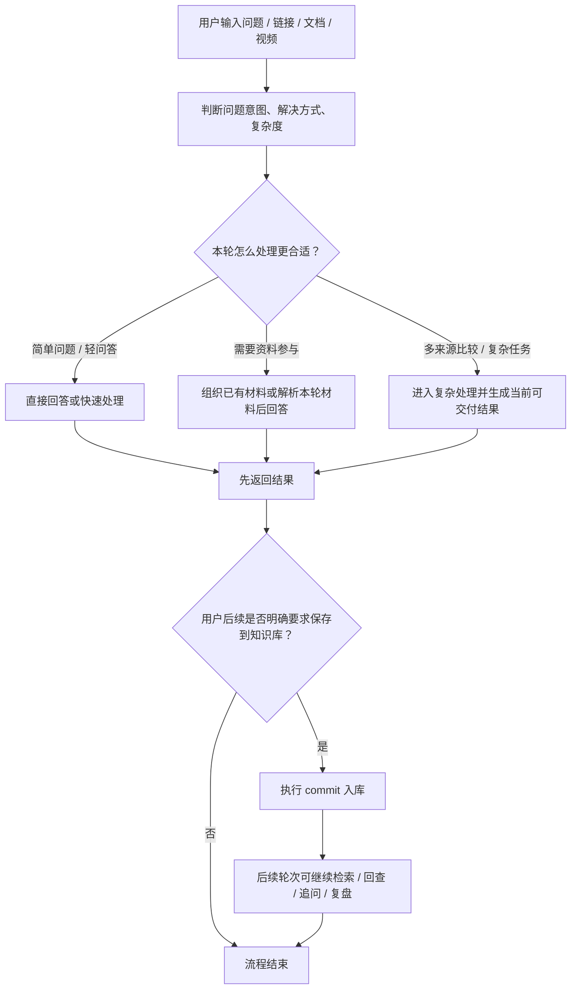
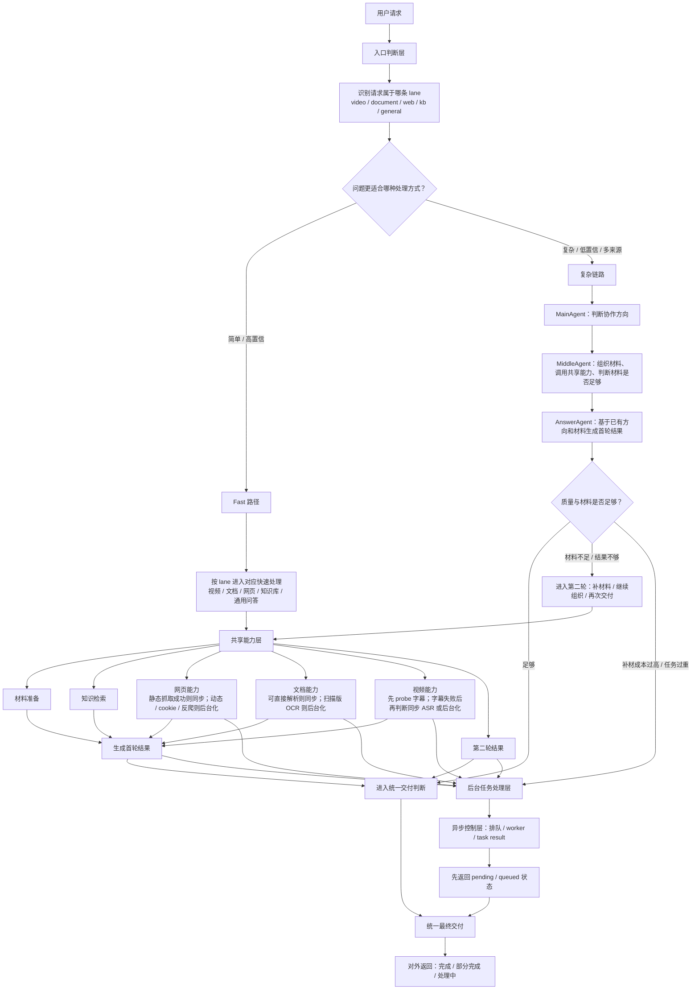

# 简版 PRD

用途：
- 产品范围说明
- 方案评审底稿
- 面试中用于展示“我会怎么定义问题、范围、边界和验收”

深度补充：
- [AI产品深度方案](/D:/1/A1_publish/docs/pm/AI产品深度方案.md)
- 本文重点承载：核心问题、用户卡点、需求目标、业务流程、产品边界、MVP、迭代机制
- 深度方案重点承载：大模型不可替代性、方案可行性、模型与 Prompt、数据标准、效果保障、灰度 / A-B / 测试方案

产品名称：
A1 多来源知识沉淀与学习复盘 AI 原型

## 1. 产品定位

A1 不是一个单纯的“多材料 AI 问答系统”，而是一个面向学习复盘与知识沉淀场景的 AI 产品原型。

它的核心目标是帮助用户把视频、网页、文档和个人笔记等一次性消费的信息，转成可长期保存、可搜索、可回查、可追问的知识资产；同时在部分场景下，支持对多个外部来源做当轮提取、比较和分析，而不强制要求这些内容先入库。

## 2. 背景与核心问题

真实的学习和研究过程往往发生在多个来源之间：用户会看视频、收藏网页、上传文档、记录笔记，也会在之后反复回看、摘录、追问和比较。

当前核心问题不是“信息太少”，而是：
- 高价值信息容易流失
- 视频内容天然不利于后续复盘
- 资料保存后不一定能被稳定找回和再次调用
- 通用知识库工具更擅长提取与总结，不一定能进一步支持持续复盘和较复杂的比较分析

一句话收敛：

`用户缺的不是更多信息，而是把高价值信息沉淀成可长期复用、可再次调用、可继续复盘的知识资产。`

## 3. 目标用户

- 学习型用户：经常通过视频、网页等材料学习，希望后续能快速复习和回看
- 研究与内容型用户：需要处理多来源资料，并围绕资料持续提问、比对、提炼信息
- 重度笔记用户：长期记录笔记和反思，希望后续能快速找回、复盘和继续追问

这些用户的主要卡点：
- 内容很多，但真正重要的信息分散且容易丢
- 视频适合学习，不适合后续复盘
- 收藏和保存不等于以后还能继续使用
- 多来源比较任务经常退化成“分别看过，但没有形成结构化判断”

## 4. 核心使用场景

### 场景 1：学习视频转文字并复盘

用户给出一个学习视频，希望系统提取字幕或文本内容，后续可以快速回看、摘录、背诵、复习。

### 场景 2：网页 / 文档 / 笔记沉淀后长期回查

用户把网页、文档或个人笔记保存到系统中，希望后续可以围绕这些资料做检索、问答和再次调用。

### 场景 3：多来源资料对比与分析

用户希望基于网页、视频、文档等多个来源，做观点对比、差异提炼和基础判断。在这一场景下，系统可以直接对外部来源做当轮抓取与比较，不一定要求先完成知识入库。

### 场景 4：长期复盘与成长洞察

用户希望 AI 能够围绕自己长期积累的笔记、资料和感受，帮助自己做更深入的复盘、提醒和观察。

说明：
这个场景是重要方向，但当前不作为已成熟能力承诺。

## 5. 产品目标

当前阶段目标：
- 把视频、网页、文档和笔记沉淀成可搜索、可回查的知识资产
- 让用户可以围绕自己的资料持续问答，而不是反复从原始内容重新查找
- 在基础问答之外，支持多个外部来源的直接比较与升级处理
- 为更长期的复盘与分析能力打基础，但不过度承诺当前效果

补充说明：
- 产品目标：验证“长期沉淀路径”和“即时比较路径”是否同时成立
- 大模型目标：在不脱离材料的前提下，提升资料组织、比较和最终交付能力

## 6. 能力结构

### 6.1 长期沉淀路径

- 视频、网页、文档、笔记进入系统
- 解析为可用文本或材料
- 在本轮先作为可用材料或 pending material 被使用
- 用户明确确认“保存到知识库”后，再正式 commit 入库
- 入库后支持后续检索、问答、追问和复盘

### 6.2 即时处理路径

- 用户直接给多个外部链接
- 系统在当轮抓取内容、提炼要点并输出比较结果
- 这条路径不强制要求先入库

## 7. 当前范围

- 多个网页 / 视频链接的当轮抓取、提炼和基础比较
- 视频内容提取、字幕整理与知识沉淀
- 网页读取、正文抽取与资料保存
- 文档上传、解析与知识入库
- 基于已沉淀资料的检索问答
- 在知识不足时补充外部网页信息
- 针对复杂问题进行升级处理与统一结果交付

## 8. 当前不重点承诺的范围

- 高稳定的长期成长教练或心理陪伴能力
- 对任意复杂问题都能稳定输出高质量深度分析
- 高质量自动理解用户长期认知变化并给出持续指导
- 商业化计费、多租户权限、企业后台等非当前阶段核心目标

## 9. MVP 范围与取舍

### 9.1 MVP 要验证什么

用户能否把高价值内容沉淀下来，并在之后围绕这些资料快速回查、追问和复盘；同时在需要时，对多个外部来源进行直接比较。

### 9.2 MVP 范围

- 一个统一主入口
- 三类优先验证的资料来源：视频、网页、文档
- 资料解析后可入库、可检索、可继续问答的最小闭环
- 一个稳定的默认回答路径
- 一个明确的复杂问题升级机制
- 一个统一结果出口，保证状态和返回口径一致

### 9.3 取舍原则

- 优先强调视频复盘、资料沉淀和知识回查这些已成立价值
- 不把复杂分析包装成当前已成熟核心卖点
- Agent、多轮协作和复杂路径是为“哪些任务不该只用普通问答处理”服务的实现机制

## 10. 核心流程

1. 用户上传文档、提供网页 / 视频链接，或直接输入问题
2. 系统识别请求类型、资料来源和复杂度
3. 若目标是长期保存与后续回查，材料进入解析、沉淀和检索准备阶段
4. 若目标是当轮多来源比较，系统可直接抓取外部来源并生成比较材料
5. 系统根据任务类型和材料充分度决定走默认路径、复杂路径或异步路径
6. 输出问答、比较结果或当前可交付结果
7. 结果经过统一质量门和统一出口后返回用户

### 10.1 业务流程说明

从业务视角看，A1 当前主要支持两条流程：

1. 回答主流程
- 用户先提出问题、链接、文档或视频
- 系统先判断这轮问题的意图、解决方式和复杂度
- 系统先给出回答，或先组织材料后再回答
- 如果用户后续明确要求保存，这轮信息才正式进入知识库
- 入库后，后续轮次才围绕这份资料继续检索、回查、追问和复盘

2. 即时比较流程
- 用户给出多个外部来源
- 系统当轮抓取并组织比较材料
- 输出基础比较结果

### 10.2 业务流程图

### 10.3 系统流程说明

从系统视角看，当前流程可理解为：
- 先判断问题属于哪一类任务
- 再决定走快速处理、材料型处理还是复杂处理
- 最终通过统一出口返回状态和结果

详细的系统层解释见：
- [AI产品深度方案](/D:/1/A1_publish/docs/pm/AI产品深度方案.md)

### 10.4 系统流程图

## 11. AI 能力设计原则

- 先围绕资料问答和分析，而不是完全依赖开放式生成
- 先保证可回查、可解释和可交付，再逐步扩展复杂分析能力
- 复杂任务需要升级，但不能对所有问题都默认走最复杂链路
- 回答质量不足时，优先升级或补材料，而不是硬给一个浅层答案

## 12. 验收标准

### 12.1 产品层验收

- 用户能够将视频、网页、文档等资料成功沉淀到系统中
- 用户能够基于沉淀资料进行检索、问答和快速回查
- 多来源比较任务能够在不依赖先入库的情况下，输出基本可用的差异提炼或对比结构
- 复杂问题在需要时能够升级，而不是始终停留在简单摘要
- 用户能够理解当前结果是已完成、部分完成还是处理中

### 12.2 工程与质量层验收

- 默认主路径真实可跑
- 关键状态字段语义一致
- 关键出口只由统一模块写入
- 复杂任务升级逻辑可复用、可验证
- 关键 benchmark、contract / smoke / migration 测试不回退

## 13. 原型与页面说明

当前文档重点放在需求和方案，不在这里展开页面细节。

建议补充的展示材料包括：
- 上传 / 沉淀 / 回查路径原型
- 多来源比较结果页原型
- 结果状态说明页

如果后续单独整理原型材料，建议作为 PRD 附件，而不是把页面细节写散在正文里。

## 14. 指标建议

建议重点关注：
- 资料沉淀成功率
- 视频 / 网页 / 文档解析成功率
- 基于资料的有效回答率
- 复杂任务升级率
- Partial 率
- 平均材料数
- 复杂任务有效完成率

详细口径见：
- [产品指标看板](/D:/1/A1_publish/docs/pm/产品指标看板.md)

## 15. 后续迭代方向

- 提升视频、网页、文档沉淀后的回查体验和结果稳定性
- 继续打磨多来源资料比较与复杂分析质量
- 探索围绕长期笔记与个人资料的复盘提醒能力
- 完善状态可解释和材料依据展示，提升用户信任感
